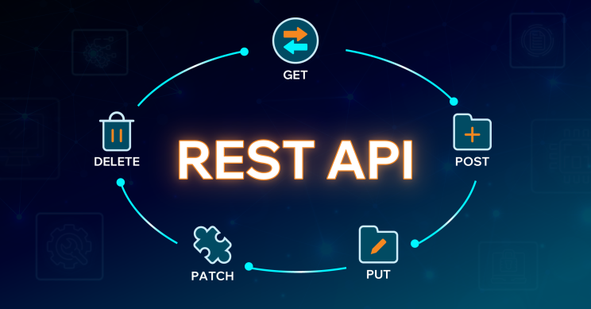

# Bonnes pratiques REST
{ style="display: block; margin: 0 auto" }

Aujourd’hui, la majorité des applications modernes — sites web, applications mobiles ou services connectés — reposent sur des **API REST** pour communiquer entre elles. Développer une API REST consiste à concevoir une interface claire et standardisée permettant à des applications clientes d’accéder à des données ou à des fonctionnalités de manière fiable, sécurisée et efficace.

Une API REST bien conçue facilite le travail des développeurs, améliore la maintenabilité du système et permet à l’application d’évoluer sans casser les usages existants. Elle repose sur des principes simples, comme l’utilisation des méthodes HTTP, des URI explicites et des formats d’échange standardisés.

Dans cette partie, nous allons voir les **bonnes pratiques essentielles** à respecter pour concevoir une API REST compréhensible, cohérente et adaptée aux besoins des applications modernes.

## Pourquoi parler de bonnes pratiques REST ?

Une API REST est rarement utilisée par une seule application. Elle est le plus souvent **consommée par d’autres équipes, d’autres services ou des applications externes**, parfois développées longtemps après sa création. La qualité de sa conception a donc un impact direct sur la facilité avec laquelle elle peut être comprise et utilisée.

Une API mal conçue peut rapidement devenir un frein : elle génère des **erreurs fréquentes**, oblige les développeurs à multiplier les vérifications côté client et complique fortement la maintenance. Par exemple, des routes peu claires, des réponses incohérentes ou des erreurs mal gérées rendent l’API difficile à exploiter et source de frustration.

À l’inverse, une API respectant les **bonnes pratiques REST** offre une expérience plus fluide. Elle est lisible, car ses routes et ses réponses sont compréhensibles sans effort. Elle est **prévisible**, puisque des actions similaires produisent des comportements cohérents. Elle est également **évolutive**, car elle peut être enrichie sans casser les applications existantes, et **facile à utiliser**, même pour un développeur qui la découvre pour la première fois.

En appliquant ces bonnes pratiques, on ne se contente pas de faire fonctionner une API : on conçoit un outil fiable, durable et agréable à utiliser, pensé pour s’intégrer efficacement dans un écosystème d’applications.

## Utiliser des URI claires et orientées ressources

Dans une API REST, les **URI** (**Uniform Resource Identifier**) jouent un rôle central : elles permettent d’identifier clairement les **ressources** mises à disposition par l’API. Une bonne pratique essentielle consiste à concevoir des URI **simples**, **lisibles** et **compréhensibles**, même sans documentation détaillée.

Une URI REST doit représenter **ce que l’on manipule**, et non **l’action effectuée**. Les actions sont déjà portées par les méthodes HTTP (```GET```, ```POST```, ```PUT```, ```DELETE```). Par exemple, une API qui gère des Pokémon exposera naturellement une ressource ```/pokemons```, plutôt qu’une route comme ```/getPokemon``` ou ```/deletePokemon```.

Exemples de bonnes pratiques :
- ```GET /pokemons``` → récupérer la liste des Pokémon
- ```GET /pokemons/25``` → récupérer le Pokémon avec l’ID 25
- ```POST /pokemons``` → créer un nouveau Pokémon

Exemples à éviter :
- ```/getPokemons```
- ```/deleteUserById```
- ```/updatePokemonStats```

Ces dernières mélangent la notion de **ressource** et **d’action**, ce qui rend l’API moins cohérente et plus difficile à maintenir.

Enfin, il est recommandé d’utiliser des **noms au pluriel** pour les collections (```/users```, ```/orders```, ```/pokemons```) et de garder une structure d’URI **stable dans le temps**. Une URI bien conçue améliore immédiatement la lisibilité de l’API et réduit les erreurs côté client.

## Bien utiliser les méthodes HTTP

Les méthodes HTTP permettent d’exprimer clairement **l’intention d’une requête** dans une API REST. Chaque méthode correspond à une action précise, et leur bon usage est fondamental pour garantir une API cohérente et prévisible.

Dans une API REST, on évite de créer des routes spécifiques pour chaque action. On combine plutôt une **URI représentant une ressource** avec la **méthode HTTP appropriée**.

### GET – Récupérer des données

La méthode ```GET``` permet de lire des informations sans jamais modifier les données côté serveur.

Exemples :
- ```GET /pokemons``` → récupérer la liste des Pokémon.
- ```GET /pokemons/25``` → récupérer Pikachu.
- ```GET /products``` → afficher le catalogue d’un site e-commerce.
- ```GET /orders/123``` → consulter une commande.

⚠️⚠️⚠️
Une requête ```GET``` doit toujours être sans effet de bord.
Dire qu’une requête **```GET``` est "sans effet de bord"** signifie qu’elle ne doit **jamais modifier l’état du serveur**. Son rôle est uniquement de **lire ou consulter des données**, pas d’en créer, modifier ou supprimer.

Autrement dit, exécuter plusieurs fois la même requête ```GET``` doit toujours produire le **même résultat**, sans provoquer d’action cachée côté serveur.

Exemples à éviter :
- ```GET /deletePokemon/25```
- ```GET /addProductToCart/12```
- ```GET /validateOrder```

Ces requêtes déclenchent des actions (suppression, ajout, validation), ce qui viole le principe REST.
⚠️⚠️⚠️

### POST – Créer une nouvelle ressource

La méthode ```POST``` est utilisée pour créer une nouvelle ressource.

Exemples :
- ```POST /pokemons``` → ajouter un Pokémon.
- ```POST /users``` → créer un compte client.
- ```POST /orders``` → passer une commande.

💡 Le serveur crée la ressource et retourne généralement un code ```201 Created```.

### PUT et PATCH – Mettre à jour une ressource

La méthode ```PUT``` remplace entièrement une ressource. À l'inverse la méthode ```PATCH``` modifie seulement certains champs

Exemples :
- ```PUT /pokemons/25``` → remplacer toutes les informations de Pikachu.
- ```PATCH /pokemons/25``` → modifier uniquement son type ou ses stats.
- ```PATCH /products/42``` → mettre à jour le prix d’un produit.

💡 ```PATCH``` est souvent préféré pour des mises à jour partielles.

### DELETE – Supprimer une ressource

La méthode ```DELETE``` permet de supprimer une ressource existante.

Exemples :
- ```DELETE /pokemons/25``` → supprimer Pikachu.
- ```DELETE /cart/items/12``` → retirer un produit du panier.

💡 Une suppression réussie renvoie souvent un code ```204 No Content```.

### Utiliser correctement les codes de statut HTTP

**Les codes de statut HTTP** permettent au client de comprendre immédiatement le résultat d’une requête. Une API REST bien conçue utilise ces codes de manière cohérente pour indiquer si une action a réussi ou échoué, et pourquoi.

#### Codes de succès
- ```200 OK``` → requête réussie
- ```201 Created``` → ressource créée (```POST```)
- ```204 No Content``` → action réussie sans contenu retourné (```DELETE```)

Exemples :
- ```GET /pokemons/25``` → ```200 OK```
- ```POST /orders``` → ```201 Created```

#### Codes d’erreur côté client
- ```400 Bad Request``` → requête invalide
- ```401 Unauthorized``` → utilisateur non authentifié
- ```403 Forbidden``` → accès interdit
-```404 Not Found``` → ressource inexistante

Exemples :
- ```GET /pokemons/9999``` → ```404 Not Found```
- ```POST /orders``` **sans données valides** → ```400 Bad Request```

#### Codes d’erreur côté serveur
- ```500 Internal Server Error``` → erreur interne
⚠️ Le client **n’est pas responsable** de ces erreurs.

#### Où voir les codes de statut HTTP dans le navigateur ?

Lorsqu’une application web communique avec une API REST, les **codes de statut HTTP** ne s’affichent pas directement à l’écran. Pour les observer, il faut utiliser les **outils de développement du navigateur**.

Dans votre navigateur, ouvrez l'**inspecteur** puis allez dans l'onglet **Network** (ou **Réseau**). Rafraîchissez la page ou déclencher une action (recherche, clic, chargement) et cliquez sur une requête API dans la liste. Vous pouvez alors observer le **Status Code** dans les détails de la requête

Ces informations peuvent vous permettres de **diagnostiquer rapidement les problèmes** : mauvaise URI, ressource inexistante, problème d’authentification ou erreur serveur.

### Structurer des réponses cohérentes et lisibles

Une API REST doit fournir des réponses **claires**, **cohérentes** et **faciles à exploiter** par les applications clientes. Le format le plus couramment utilisé est le **JSON**, car il est léger, lisible et compatible avec la majorité des langages de programmation.

Il est important de conserver une **structure stable** dans les réponses. Deux requêtes similaires doivent retourner des données organisées de la même manière, afin d’éviter des traitements spécifiques côté client.

Exemple avec le Pokédex :
```json
{
  "id": 25,
  "name": "pikachu",
  "types": ["electric"]
}
```

Exemple d'e-commerce :
```json
{
  "id": 42,
  "name": "Clavier mécanique",
  "price": 99.99
}
```

Une réponse bien structurée réduit le risque d’erreurs, facilite la lecture du code et améliore l’expérience développeur.

### Gérer les erreurs de manière explicite

Une bonne API REST ne se contente pas d’indiquer qu’une erreur s’est produite, elle explique pourquoi. Lorsqu’une requête échoue, l’API doit retourner un **code HTTP approprié**, accompagné d’un message compréhensible.
```json
{
  "error": "Pokemon not found"
}
```
Dans un contexte e-commerce, un message comme "Product out of stock" est bien plus utile qu’une erreur générique. Une gestion claire des erreurs permet aux développeurs clients de **réagir correctement** (afficher un message utilisateur, relancer une requête, etc.).

### Pagination, filtres et tri des données

Lorsqu’une API retourne un grand nombre de ressources, il est essentiel de **limiter la quantité de données renvoyées**. La pagination, les filtres et le tri permettent d’améliorer les performances et la lisibilité des réponses.

Exemples :
- ```GET /pokemons?page=2&limit=20```
- ```GET /products?category=electronics```
- ```GET /orders?sort=date&order=desc```

Ces mécanismes évitent de surcharger le réseau et permettent aux applications clientes d’afficher les données de manière progressive et fluide.

### Versionner son API

Une API REST est amenée à évoluer dans le temps. Ajouter de nouvelles fonctionnalités ou modifier des comportements peut casser des applications existantes si aucune stratégie de versioning n’est mise en place.

La solution consiste à **versionner l’API**, généralement directement dans l’URI.

Exemples :
- ```/api/v1/pokemons```
- ```/api/v2/pokemons```

Cela permet de faire évoluer l’API sans impacter les clients utilisant une version précédente, tout en laissant le temps aux applications de migrer.

### Introduction à la sécurité et au contrôle des accès

Une API REST ne doit jamais exposer directement l’ensemble de son système. Il est essentiel de contrôler **qui peut accéder à quoi**, et dans quelles conditions.

Les mécanismes les plus courants incluent :
- clés API
- tokens d’authentification (JWT, OAuth)
- restrictions de permissions

Par exemple, un **utilisateur peut consulter des produits** (```GET /products```), mais seul un **administrateur pourra en créer ou en supprimer.** Ce contrôle d’accès protège les données sensibles et limite les abus.

### Documentation et expérience développeur

Une API REST bien conçue doit être **facile à comprendre et à tester**, même pour un développeur qui la découvre pour la première fois. Une documentation claire est donc indispensable.

Des outils comme **Swagger** / **OpenAPI**, **Postman** ou **curl** permettent de documenter, tester et partager facilement une API. Une bonne documentation décrit :
- les endpoints disponibles
- les méthodes HTTP utilisées
- les paramètres attendus
- les réponses possibles

Une API bien documentée améliore considérablement la productivité et réduit les erreurs d’intégration.

## Pour résumé

Une API REST bien conçue ne se limite pas à fonctionner : elle doit être **compréhensible**, **fiable** et **agréable à utiliser**. En respectant les bonnes pratiques REST — structuration claire des ressources, utilisation correcte des méthodes HTTP, gestion explicite des erreurs, versioning et documentation — on crée des APIs **durables** et **évolutives**.

Ces principes facilitent le travail des équipes, réduisent les erreurs et permettent aux applications clientes de s’intégrer rapidement et efficacement. Dans la suite du cours, ces bonnes pratiques serviront de **référence** pour analyser, consommer et concevoir des APIs de qualité professionnelle.

## Ressources utiles

Les codes de statut de réponse HTTP : https://developer.mozilla.org/fr/docs/Web/HTTP/Reference/Status

## Pratique

Il est temps de passer à la pratique.
Dans le dossier pratique ouvrez le fichier [analyse-manipulation-REST.md](./pratique/analyse-manipulation-REST.md) et suivez les instructions.

---

© Vincent Chiofalo