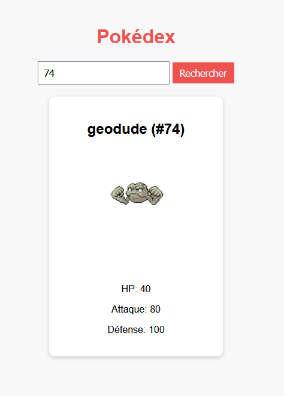
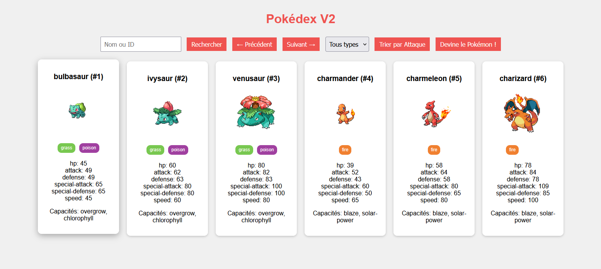

# Manipuler une API REST (avec JavaScript)
{ style="display: block; margin: 0 auto" }

Avant de manipuler ou de développer une API, il est important de connaître les bonnes pratiques pour travailler avec n’importe quelle API REST.

Les API permettent d’accéder à des données distantes et de les exploiter dans vos applications.

Une bonne pratique consiste à **tester et comprendre chaque requête** avant d’essayer de manipuler des données complexes.

Il est aussi essentiel de **bien gérer les erreurs et les réponses asynchrones**, pour que l’application reste stable et compréhensible.

On va voir les concepts clés étape par étape, avec des analogies simples pour mieux comprendre.

## URI et Endpoints

**URI** (**Uniform Resource Identifier**) est l’adresse qui identifie la ressource que l’on veut consulter ou manipuler.
Par exemple : https://pokeapi.co/api/v2/pokemon/1 → l’URI qui désigne Bulbizarre.

Un **endpoint** correspond à une URI **précise** d’une API et permet d’accéder à des **informations spécifiques**.
Par exemple : 
- https://pokeapi.co/api/v2/pokemon/1 → Pokémon par ID
- https://pokeapi.co/api/v2/type/fire → Liste des Pokémon de type feu

💡 Petite astuce : toujours vérifier que l’URI fonctionne dans le navigateur avant de l’utiliser dans votre code.

## ```fetch``` – récupérer des données depuis une API

```fetch``` est la fonction JavaScript qui permet de faire **une requête HTTP** vers un endpoint.
On **récupère** ensuite ces informations avec la méthode ```.then()``` pour **traiter la réponse lorsque la requête est terminée**.
La méthode ```.catch()``` permet de **gérer les erreurs d’une requête**, en **exécutant un code spécifique** si la **promesse est rejetée** ou si un **problème survient pendant le fetch**.
```js
fetch('https://pokeapi.co/api/v2/pokemon/1')
  .then(res => res.json()) // Transformer la réponse en JSON
  .then(data => console.log(data)) // Afficher les données récupérées
  .catch(err => console.error('Erreur:', err)); // Gérer les erreurs
```

**Les bonnes pratiques** :
- Toujours utiliser ```catch``` pour gérer les erreurs.
- Vérifier ```res.ok``` si vous voulez savoir si la requête a réussi avant de traiter les données.
```js
fetch('https://pokeapi.co/api/v2/pokemon/9999') // ID inexistant
  .then(res => {
    if (!res.ok) throw new Error(`Erreur ${res.status} : Pokémon non trouvé`);
    return res.json(); // Transformer la réponse en objet JS si OK
  })
  .then(pokemon => console.log(pokemon.name))
  .catch(err => console.error('Erreur détectée :', err.message));
```

## Promises – gérer l’asynchronisme

Les appels à une API sont **asynchrones**. Votre code continue de s’exécuter pendant que l’API répond. ```fetch``` retourne une **Promise**, c’est-à-dire un objet qui représente une valeur qui sera disponible **dans le futur**.

## ```res.json()``` – transformer la réponse

Par convention, on nomme la réponse de notre requête ```res```. La méthode ```.json()``` **convertit la réponse brute** de l’API en **objet JavaScript** exploitable.
```js
fetch('https://pokeapi.co/api/v2/pokemon/1')
  .then(res => {
    if (!res.ok) throw new Error('Erreur de requête');
    return res.json(); // Transformation JSON → JS
  })
  .then(pokemon => console.log(pokemon.name)) // "bulbasaur"
  .catch(err => console.error(err));
```

## Gestion des erreurs (```error```)

Quand on fait un ```fetch```, **tout ne se passe pas toujours comme prévu** : serveur indisponible, endpoint incorrect, dépassement de quota, etc. JavaScript utilise ```.catch()``` pour récupérer les erreurs. On peut aussi **vérifier le statut de la réponse** (```res.ok```) pour **détecter les problèmes avant de transformer la réponse en JSON**.
```js
fetch('https://pokeapi.co/api/v2/pokemon/9999') // ID inexistant
  .then(res => {
    if (!res.ok) throw new Error(`Erreur ${res.status} : Pokémon non trouvé`);
    return res.json();
  })
  .then(pokemon => console.log(pokemon.name))
  .catch(err => console.error('Erreur détectée :', err.message));
```
En bref :
- ```res.ok``` : indique si la **requête HTTP a réussi** (200-299).
- ```throw new Error(...)``` : crée une **erreur personnalisée** si la requête échoue.`
- ```.catch(err => ...)``` : récupère **toutes les erreurs**, qu’elles viennent du fetch ou du ```throw```.
- ```err.message``` : affiche un message clair pour l’utilisateur ou pour la console.

**Les bonnes pratiques** :
- Toujours afficher un **message clair** pour savoir ce qui s’est mal passé.
- Ne jamais laisser une erreur *"exploser"* le programme, utilisez toujours ```.catch()```.
- Pour plusieurs fetch simultanés (```fetchMultiple```), gérer les erreurs **individuellement** avec ```Promise.allSettled()``` si besoin.

## fetchMultiple – récupérer plusieurs données

Pour afficher plusieurs données à la fois, on peut utiliser ```Promise.all```. Cela permet de lancer **plusieurs fetch simultanément** et de récupérer toutes les données ensemble. Cela permet de lancer **plusieurs fetch simultanément** et de récupérer toutes les données ensemble.
```js
const ids = [1, 2, 3]; // IDs des Pokémon à récupérer

const promises = ids.map(id => fetch(`https://pokeapi.co/api/v2/pokemon/${id}`).then(res => res.json()));

Promise.all(promises)
  .then(pokemons => {
    pokemons.forEach(p => console.log(p.name)); // Affiche les noms des Pokémon
  })
  .catch(err => console.error(err));
```
**Les bonnes pratiques** :
- Toujours limiter le nombre de requêtes simultanées pour éviter de surcharger l’API.
- Utiliser ```Promise.all``` pour synchroniser l’affichage après avoir tout récupéré.
- Gérer les erreurs individuellement si besoin avec ```Promise.allSettled```.

## ```Promise.all``` – gérer plusieurs requêtes en même temps

```Promise.all``` est une méthode qui permet de **gérer plusieurs promesses simultanément** et d’attendre que **toutes soient résolues** avant de continuer. C’est particulièrement utile lorsque vous voulez récupérer plusieurs ressources depuis une API.

Par exemple : si vous récupérez trois Pokémon à la fois, ```Promise.all``` s’assure que **toutes les requêtes sont terminées** avant de traiter les données, ce qui permet de les afficher ensemble dans l’application. Si l’une des promesses échoue, ```.catch()``` permet de **capturer l’erreur et d’afficher un message clair**.

## En résumé

| Concept        | Explication simple                          | Exemple clé                           |
| -------------- | ------------------------------------------- | ------------------------------------- |
| URI / Endpoint | Adresse pour accéder à une ressource        | `https://pokeapi.co/api/v2/pokemon/1` |
| fetch          | Fonction JS pour récupérer des données      | `fetch(url).then(...).catch(...)`     |
| Promise        | Objet qui sera résolu plus tard             | `fetch(...).then(...)`                |
| .then()        | Traite le résultat si OK                    | `.then(res => res.json())`            |
| .catch()       | Gère l’erreur si problème                   | `.catch(err => console.error(err))`   |
| res.json()     | Transforme la réponse en JS                 | `res.json()`                          |
| fetchMultiple  | Récupère plusieurs ressources simultanément | `Promise.all([...])`                  |


## Pratique

Il est temps de passer à la pratique.
Dans le dossier [pokedex_v1](./pratique/pokedex_v1/) ouvrez les fichiers et suivez les instructions dans le fichier [script.js](./pratique/pokedex_v1/script.js) afin de commencer votre premier pokedex.

{ style="display: block; margin: 0 auto" }

Ensuite dans le dossier [pokedex_v2](./pratique/pokedex_v2/) ouvrez les fichiers et complétez les fonctions dans le fichier [script,js](./pratique/pokedex_v2/script.js) afin d'avoir votre pokedex amélioré. Vous pouvez modifier tout l'affichage à votre convenance.

{ style="display: block; margin: 0 auto" }

---

© Vincent Chiofalo