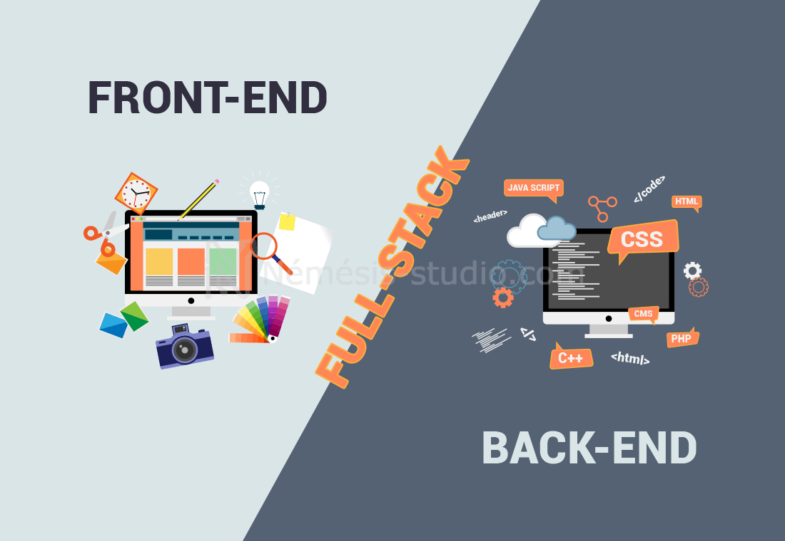
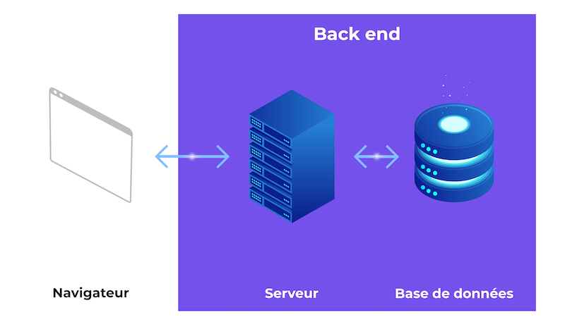

# Introduction

## Introduction au développement web et son importance dans le monde actuel

{ style="display: block; margin: 0 auto" }

Le **développement web** désigne le processus de création, de programmation et de maintenance de sites web et d'applications accessibles via Internet. Il permet aux utilisateurs d'accéder à des informations, d'acheter des produits, de communiquer, de se former et de travailler en ligne.

Aujourd'hui, le développement web ne se limite plus à la création de pages statiques : les sites et applications web sont devenus de véritables outils interactifs, capables de traiter des données, de communiquer avec des serveurs et de proposer des services complexes.

### Qu'est-ce que le développement web ?

{ style="display: block; margin: 0 auto" }

Le développement web se divise généralement en deux grandes catégories complémentaires : le **Front-End** et le **Back-End**.

#### Le Front-End — développement côté client

{ style="display: block; margin: 0 auto" }

Le **Front-End** correspond à tout ce que l'utilisateur voit et avec quoi il interagit directement dans son navigateur.

Il repose principalement sur trois technologies fondamentales :
- **HTML (HyperText Markup Language)** : permet de structurer le contenu d'une page web, comme les textes, les titres, les images, les liens, les formulaires ou encore les tableaux.
- **CSS (Cascading Style Sheets)** : permet de gérer la présentation et l'apparence de la page : couleurs, typographies, espacements, dimensions, positionnement, animations et adaptation aux différentes tailles d'écran.
- **JavaScript** : permet d'ajouter du comportement et de l'interactivité à une page web, par exemple des menus dynamiques, des formulaires interactifs, des animations ou la mise à jour de contenu sans recharger toute la page.

Dans ce cours, nous nous concentrerons principalement sur **HTML5** et **CSS3**, qui constituent les fondations du développement Front-End.

### Le Back-End — développement côté serveur

{ style="display: block; margin: 0 auto" }

Le **Back-End** correspond à la partie d'une application web qui fonctionne principalement côté serveur. Elle n'est généralement pas directement visible par l'utilisateur.

Le Back-End peut notamment être chargé de :
- gérer les comptes utilisateurs ;
- traiter les données envoyées par les utilisateurs ;
- communiquer avec une base de données ;
- gérer l'authentification ;
- appliquer les règles métier d'une application ;
- fournir des données au Front-End ;
- communiquer avec différents services ou API.

De nombreux langages et environnements peuvent être utilisés pour développer le Back-End, notamment **PHP**, **Python**, **Java**, **C#**, **Ruby** ou **JavaScript avec Node.js**.

Les applications utilisent également des systèmes de gestion de bases de données tels que **MySQL**, **PostgreSQL**, **MongoDB** ou **Microsoft SQL Server**.

### Le Full-Stack

{ style="display: block; margin: 0 auto" }

Le terme **Full-Stack** désigne le développement d'une application à la fois sur la partie Front-End et sur la partie Back-End.

Un développeur Full-Stack peut ainsi intervenir sur l'interface utilisateur, la logique serveur, les API et les bases de données.

On peut résumer les trois notions ainsi :
- **Front-End** → ce que l'utilisateur voit et utilise ;
- **Back-End** → ce qui fonctionne côté serveur ;
- **Full-Stack** → maîtrise des deux domaines.

### L'importance du développement web dans le monde actuel

Le développement web est devenu un élément majeur de notre société numérique. Il intervient dans de nombreux secteurs : commerce, éducation, santé, administration, finance, communication, industrie ou encore divertissement.

#### Un canal essentiel pour les entreprises

Le Web constitue aujourd'hui un moyen essentiel pour une entreprise de présenter son activité et de communiquer avec ses clients.

Un simple site vitrine peut permettre de :
- présenter une entreprise ;
- présenter ses produits ou services ;
- communiquer ses coordonnées ;
- publier ses actualités ;
- développer sa visibilité.

Les plateformes e-commerce vont beaucoup plus loin en permettant aux utilisateurs de consulter des produits, de passer des commandes et d'effectuer des paiements en ligne.

Le développement web participe donc directement à la **présence numérique des organisations**.

#### La digitalisation des services

Le développement web permet également de transformer de nombreux processus autrefois réalisés sur papier ou en présentiel.

De nombreux services sont aujourd'hui accessibles depuis un navigateur :
- banques en ligne ;
- démarches administratives ;
- réservation de billets ;
- plateformes de formation ;
- outils de gestion ;
- logiciels professionnels ;
- plateformes collaboratives.

Les applications SaaS (Software as a Service) constituent un exemple important de cette évolution. Elles permettent d'utiliser un logiciel directement depuis Internet, généralement sans avoir à installer une application complète sur son ordinateur.

#### Une accessibilité depuis de nombreux appareils

L'un des grands avantages du Web est son accessibilité depuis une grande variété d'appareils.

Un même site peut être consulté depuis :
- 💻 un ordinateur ;
- 📱 un smartphone ;
- 📲 une tablette ;
- 📺 une télévision connectée ;
- d'autres appareils disposant d'un navigateur compatible.

Cette diversité impose aux développeurs de concevoir des interfaces capables de s'adapter aux différentes tailles d'écran.

C'est notamment le rôle du responsive web design, qui permet à une interface de s'adapter automatiquement à son environnement d'affichage.

#### L'accessibilité et l'inclusion

Le développement web doit également prendre en compte les personnes en situation de handicap.

Un site accessible doit notamment permettre à différents utilisateurs d'accéder aux contenus et aux fonctionnalités, y compris ceux qui utilisent :
- un lecteur d'écran ;
- une navigation au clavier ;
- des technologies d'assistance ;
- des dispositifs d'affichage particuliers.

**L'accessibilité numérique** constitue donc une dimension importante du développement web moderne.

HTML joue notamment un rôle essentiel grâce à l'utilisation d'une structure sémantique correcte.

#### Un support pour l'innovation

Le Web évolue constamment et accompagne de nombreuses innovations technologiques.

Les technologies web peuvent notamment être utilisées pour proposer :
- des assistants conversationnels ;
- des systèmes de recommandation ;
- des applications utilisant l'intelligence artificielle ;
- des visualisations de données interactives ;
- des applications 3D ;
- des expériences de réalité augmentée ou virtuelle ;
- des applications collaboratives en temps réel.

Le navigateur est ainsi devenu une véritable plateforme d'exécution pour des applications de plus en plus complexes.

#### L'accès à l'information et à la connaissance

Le Web a profondément transformé notre manière d'accéder à l'information.

Il permet notamment de consulter :
- des encyclopédies ;
- des sites d'actualité ;
- des plateformes éducatives ;
- des cours en ligne ;
- des documentations techniques ;
- des bibliothèques numériques ;
- des forums et communautés.

Le développement web joue donc un rôle important dans la diffusion des connaissances et dans l'accès à l'information.

#### La communication et les interactions sociales

Les technologies web permettent également aux utilisateurs de communiquer et de collaborer à distance.

Les réseaux sociaux, forums, plateformes de discussion et outils collaboratifs reposent sur des technologies permettant de gérer des millions d'utilisateurs et de grandes quantités de données.

Le Web est ainsi devenu un espace majeur de **communication**, de **collaboration** et de **partage**.

### Les enjeux du développement web

La croissance du Web s'accompagne également de nombreux enjeux que les développeurs doivent prendre en compte.

🔒 **La sécurité**

Les applications web manipulent parfois des données sensibles. Il est donc nécessaire de protéger les utilisateurs et les systèmes contre les différentes formes d'attaques informatiques.

⚡ **La performance**

Une application doit pouvoir fonctionner rapidement et efficacement, y compris lorsque les utilisateurs disposent d'une connexion ou d'un appareil moins performant.

♿ **L'accessibilité**

Les interfaces doivent être conçues pour être utilisables par le plus grand nombre, quelles que soient les capacités des utilisateurs.

📱 **L'adaptation aux appareils**

Les utilisateurs utilisent une grande variété d'écrans et de dispositifs. Les interfaces doivent donc pouvoir s'adapter à ces différents contextes.

🌍 **La compatibilité**

Les développeurs doivent tenir compte des différents navigateurs, systèmes d'exploitation et environnements utilisés par les internautes.

🧩 **La maintenabilité**

Un projet web peut évoluer pendant plusieurs années. Le code doit donc être organisé, compréhensible et suffisamment robuste pour pouvoir être modifié et amélioré.

### Pour conclure

Le développement web est bien plus que l'écriture de quelques lignes de code permettant d'afficher une page dans un navigateur.

Il constitue l'une des bases de notre environnement numérique et intervient aujourd'hui dans de nombreux domaines : commerce, communication, éducation, administration, travail, divertissement et accès à l'information.

Pour comprendre le développement web, il est essentiel de connaître les trois technologies fondamentales du Front-End :
- **HTML** → structure le contenu ;
- **CSS** → définit la présentation ;
- **JavaScript** → ajoute le comportement et l'interactivité.

Dans la suite de ce cours, nous allons commencer par **HTML5**, qui constitue la structure et le squelette des pages web. Nous verrons ensuite **CSS3**, qui permettra de donner une identité visuelle et une mise en page professionnelle à ces pages.

## Comprendre le rôle d'HTML dans la création d'une structure de page web

**HTML** (**HyperText Markup Language**) est le langage utilisé pour structurer le contenu d'une page web. Il constitue l'une des technologies fondamentales du développement web et sert de base à toutes les pages accessibles depuis un navigateur.

HTML permet d'indiquer au navigateur **ce qu'est chaque élément d'une page** : un titre, un paragraphe, une image, un lien, une liste, un formulaire, une section, un pied de page, etc.

Contrairement à un langage de programmation, HTML ne sert pas principalement à effectuer des calculs ou à définir des algorithmes. Il s'agit d'un **langage de balisage**, dont le rôle est de décrire la structure et la signification du contenu.

On peut résumer simplement : **HTML structure le contenu, CSS le met en forme et JavaScript le rend interactif.**

### Qu'est-ce que HTML ?

HTML signifie **HyperText Markup Language**, que l'on peut traduire par langage de balisage hypertexte.

Il permet de créer la structure d'un document web à l'aide de balises.

Par exemple :
```html
<h1>Bienvenue sur mon site</h1>

<p>Ceci est mon premier paragraphe.</p>
```

Dans cet exemple :
- ```<h1>``` indique qu'il s'agit d'un titre principal ;

- ```<p>``` indique qu'il s'agit d'un paragraphe.

Les balises permettent donc au navigateur de comprendre la nature des différents contenus présents dans la page.

### HTML : le squelette d'une page web

Pour comprendre le rôle d'HTML, on peut comparer une page web à un bâtiment.
- **HTML** représente la structure du bâtiment ;
- **CSS** représente la décoration, les couleurs et l'aménagement ;
- **JavaScript** représente les mécanismes permettant au bâtiment de réagir aux actions des utilisateurs.

Sans HTML, il n'existe pas de structure permettant d'organiser correctement le contenu de la page.

Une page web peut ainsi être représentée de manière simplifiée :
```
Page web
│
├── En-tête
│   ├── Logo
│   └── Navigation
│
├── Contenu principal
│   ├── Titre
│   ├── Texte
│   ├── Image
│   └── Articles
│
└── Pied de page
    └── Informations complémentaires
```

HTML permet de représenter cette organisation.

### Le principe des balises HTML

Une balise HTML est généralement composée d'une **balise ouvrante** et d'une **balise fermante**.

Exemple :
```html
<p>Bonjour et bienvenue !</p>
```

On retrouve :
- ```<p>``` : balise ouvrante ;
- ```Bonjour et bienvenue !``` : contenu ;
- ```</p>``` : balise fermante.

L'ensemble constitue un **élément HTML**.

```
<p>Bonjour et bienvenue !</p>
│ │                     │
│ └── contenu           │
│                       │
└── balise ouvrante     └── balise fermante
```


Certaines balises ne nécessitent pas de balise fermante.

Par exemple :
```html

```

La balise `````` permet d'insérer une image dans une page.

### Les attributs HTML

Les balises HTML peuvent également contenir des **attributs**.

Les attributs permettent de fournir des informations supplémentaires à un élément.

Exemple :
```html
<a href="https://www.example.com">
    Visiter le site
</a>
```

Ici :

- ```<a>``` définit un lien ;
- ```href``` est un attribut ;
- la valeur de ```href``` indique la destination du lien.

Un autre exemple :
```html

```

La balise `````` possède ici deux attributs :
- ```src``` indique l'emplacement de l'image ;
- ```alt``` fournit une description textuelle de l'image.

Les attributs sont particulièrement importants pour **l'accessibilité**, le fonctionnement des éléments et la communication d'informations au navigateur.

### HTML et structure hiérarchique

Une page HTML est organisée selon une structure **hiérarchique**.

Les éléments peuvent être placés à l'intérieur d'autres éléments. On parle alors d'**imbrication**.

Exemple :
```html
<body>

    <main>

        <h1>Mon site web</h1>

        <p>
            Bienvenue sur mon site.
        </p>

    </main>

</body>
```

On peut représenter cette structure sous forme d'arbre :
```
body
└── main
    ├── h1
    └── p
```

Cette organisation hiérarchique est fondamentale en HTML.

Elle permet notamment au navigateur, aux moteurs de recherche et aux technologies d'assistance de comprendre la structure du document.

### La structure minimale d'une page HTML5

Une page HTML5 possède une structure de base que l'on retrouvera dans la plupart des projets.
```html
<!DOCTYPE html>

<html lang="fr">

<head>
    <meta charset="UTF-8">
    <title>Ma première page web</title>
</head>

<body>

    <h1>Bienvenue sur mon site</h1>

    <p>
        Voici ma première page HTML5.
    </p>

</body>

</html>
```

Cette structure peut sembler complexe au début, mais chaque partie possède un rôle précis.

### Le DOCTYPE

La première ligne est :

```html
<!DOCTYPE html>
```

Elle indique au navigateur que le document utilise la norme HTML5.

Le ```DOCTYPE``` n'est pas une balise HTML classique. Il s'agit d'une déclaration qui permet notamment au navigateur d'interpréter correctement le document.

### L'élément ```<html>```

L'élément ```<html>``` constitue la racine du document HTML.
```html
<html lang="fr">
```

L'attribut ```lang``` indique la langue principale du document.

Dans notre exemple :
```html
lang="fr"
```
signifie que le contenu principal de la page est en français.

Cette information est notamment utile pour les **technologies d'assistance** et certains moteurs de recherche.

### La partie ```<head>```

L'élément ```<head>``` contient des informations concernant le document qui ne sont généralement pas affichées directement dans le contenu de la page.

Exemple :
```html
<head>

    <meta charset="UTF-8">

    <title>Mon site web</title>

</head>
```

On peut notamment y trouver :
- le titre de la page ;
- les informations de métadonnées ;
- les liens vers les feuilles de style CSS ;
- certaines informations destinées aux moteurs de recherche ;
- des ressources externes.

Par exemple :
```html
<title>Mon site web</title>
```

définit le titre associé à la page, notamment visible dans l'onglet du navigateur.

### La partie ```<body>```

L'élément ```<body>``` contient le contenu visible de la page.

On y trouve notamment :
- les titres ;
- les paragraphes ;
- les images ;
- les liens ;
- les listes ;
- les tableaux ;
- les formulaires ;
- les vidéos ;
- les différentes sections de la page.

Exemple :
```html
<body>

    <h1>Bienvenue</h1>

    <p>
        Découvrez notre site web.
    </p>

</body>
```
C'est principalement dans cette partie que nous allons construire la structure de nos pages.

### Les titres et les paragraphes

HTML fournit plusieurs niveaux de titres.
```html
<h1>Titre principal</h1>

<h2>Sous-titre</h2>

<h3>Sous-section</h3>

<h4>Sous-section</h4>
```

Le niveau va de ```<h1>``` à ```<h6>```.

Il est important de ne pas choisir les titres uniquement en fonction de leur apparence visuelle. Leur niveau doit correspondre à la **hiérarchie du contenu**.

Par exemple :
```html
<h1>Développement web</h1>

<h2>HTML</h2>

<h3>Les balises</h3>

<h3>Les attributs</h3>

<h2>CSS</h2>

<h3>Les sélecteurs</h3>
```

Cette structure permet de représenter clairement l'organisation du document.

Les paragraphes sont quant à eux définis avec la balise ```<p>``` :
```html
<p>
    HTML permet de structurer le contenu d'une page web.
</p>
```

### Les liens hypertextes

L'une des caractéristiques fondamentales du Web est la possibilité de naviguer d'une ressource à une autre.

HTML permet de créer des liens avec la balise ```<a>```.
```html
<a href="https://www.example.com">
    Visiter le site
</a>
```

L'attribut ```href``` indique la destination du lien.

Les liens peuvent pointer vers :
- une autre page du même site ;
- une autre partie de la page ;
- un autre site ;
- un document ;
- une adresse e-mail ou d'autres ressources.

Les liens sont à l'origine du terme ```HyperText``` présent dans le nom HTML.

### Les images

HTML permet également d'intégrer des images.
```html

```

L'attribut ```src``` indique la source de l'image.

L'attribut ```alt``` fournit une **alternative textuelle** à l'image.

Cette information est particulièrement importante lorsqu'une personne ne peut pas voir l'image, notamment lorsqu'elle utilise un lecteur d'écran.

L'attribut ```alt``` ne doit donc pas être considéré comme une simple option : il participe à la création de contenus accessibles.

### Les balises sémantiques HTML5

HTML5 a introduit ou renforcé l'utilisation de nombreuses balises permettant de donner une **signification** aux différentes parties d'une page.

Parmi les principales balises sémantiques :
- ```<header>``` : en-tête d'une page ou d'une section ;
- ```<nav>``` : zone de navigation ;
- ```<main>``` : contenu principal ;
- ```<section>``` : section thématique ;
- ```<article>``` : contenu autonome ;
- ```<aside>``` : contenu complémentaire ;
- ```<footer>``` : pied de page ou de section.

Par exemple :
```html
<body>

    <header>
        <h1>Mon site</h1>
    </header>

    <nav>
        <a href="#">Accueil</a>
        <a href="#">À propos</a>
        <a href="#">Contact</a>
    </nav>

    <main>

        <section>
            <h2>Présentation</h2>

            <p>
                Bienvenue sur notre site.
            </p>
        </section>

    </main>

    <footer>
        <p>© 2026 Mon site</p>
    </footer>

</body>
```

Cette approche est appelée **HTML sémantique**.

L'objectif est de choisir les éléments HTML en fonction de leur **signification**, plutôt que simplement en fonction de leur apparence.

### Pourquoi utiliser du HTML sémantique ?

Le HTML sémantique présente plusieurs avantages.

♿ **Accessibilité**

Les technologies d'assistance peuvent mieux comprendre la structure d'une page.

🔎 **Référencement**

Une structure HTML claire peut faciliter la compréhension du contenu par les moteurs de recherche.

🧑‍💻 **Maintenance**

Un code utilisant des balises adaptées est généralement plus facile à comprendre et à maintenir.

🌍 **Standardisation**

L'utilisation correcte des éléments HTML facilite la compréhension du document par les navigateurs et les différents outils utilisés sur le Web.

## HTML et CSS : deux rôles différents

Il est important de ne pas confondre la structure HTML avec la présentation CSS.

Par exemple :
```html
<h1>Bienvenue sur mon site</h1>
```

HTML indique :

« Ceci est un titre principal. »

CSS peut ensuite indiquer :
```css
h1 {
    color: blue;
    font-size: 40px;
}
```

CSS indique alors :

« Voici comment ce titre doit être présenté visuellement. »

Cette séparation entre **structure** et **présentation** est une notion fondamentale du développement web.

### HTML, CSS et JavaScript

Une page web moderne peut être représentée simplement de la manière suivante :
```
HTML
  ↓
Structure et contenu

CSS
  ↓
Présentation et mise en page

JavaScript
  ↓
Comportement et interactivité

        ↓

   PAGE WEB
```

Chaque technologie possède donc un rôle spécifique.
- **HTML** → Que contient la page ?
- **CSS** → Comment la page doit-elle être présentée ?
- **JavaScript** → Comment la page doit-elle réagir ?

Cette séparation constitue l'une des bases du développement Front-End.

## Les bonnes pratiques essentielles en HTML

Dès les premiers exercices, il est important d'adopter de bonnes habitudes.

#### SUtiliser des balises adaptées

Choisir une balise en fonction de son rôle et de sa signification.

#### Respecter la hiérarchie des titres

Utiliser ```<h1>```, ```<h2>```, ```<h3>```, etc. pour représenter correctement la structure du contenu.

#### Indiquer la langue du document
```html
<html lang="fr">
```

#### Ajouter un texte alternatif aux images pertinentes
```html

```

#### Organiser correctement le code

Une indentation claire facilite la lecture et la maintenance.

#### Séparer HTML et CSS

HTML doit principalement s'occuper de la structure tandis que CSS prend en charge la présentation.

## À retenir

HTML est le **langage de structure du Web**.

Il permet :
- de structurer le contenu d'une page ;
- de définir une hiérarchie entre les différents éléments ;
- de créer des titres et des paragraphes ;
- d'intégrer des images et des médias ;
- de créer des liens ;
- de construire des formulaires ;
- d'organiser les différentes parties d'une page ;
- de donner du sens au contenu grâce aux éléments sémantiques.

La structure minimale d'une page HTML5 repose notamment sur :
```
<!DOCTYPE html>
    ↓
<html>
    ├── <head>
    │     ├── <meta>
    │     └── <title>
    │
    └── <body>
          └── Contenu de la page
```

Enfin, il faut retenir une règle fondamentale :

*HTML décrit la structure et le sens du contenu ; CSS s'occupe de sa présentation.*

Dans le prochain chapitre, nous pourrons entrer dans la pratique en étudiant la **syntaxe HTML5**, **les balises**, **les attributs** et **la création d'une première page web**.

## Connaître la syntaxe de base d'HTML : balises, éléments et attributs

Après avoir découvert le rôle d'HTML dans la structure d'une page web, il est maintenant nécessaire de comprendre sa **syntaxe de base**.

Pour écrire du HTML correctement, trois notions sont essentielles :
- les **balises** ;
- les **éléments** ;
- les **attributs**.

La compréhension de ces trois notions permet de lire, écrire et organiser progressivement du code HTML.

### Les balises HTML

Une **balise** est un élément de syntaxe utilisé par HTML pour indiquer au navigateur la nature d'un contenu.

Une balise est généralement écrite entre les caractères ```<``` et ```>```.

Par exemple :
```html
<p>
```

Cette balise indique le début d'un paragraphe.

Pour de nombreux éléments, une deuxième balise permet d'indiquer la fin du contenu :
```html
</p>
```

La barre oblique ```/``` permet ici d'indiquer qu'il s'agit d'une **balise fermante**.

On obtient donc :
```html
<p>Bonjour !</p>
```

On distingue ainsi :
- ```<p>``` → balise ouvrante ;
- ```Bonjour !``` → contenu ;
- ```</p>``` → balise fermante.

### Balises ouvrantes et fermantes

La forme générale est :
```html
<nom-de-balise>contenu</nom-de-balise>
```
Par exemple :
```html
<h1>Bienvenue</h1>
<p>Découvrez mon site web.</p>
<strong>Texte important</strong>
```

Chaque balise indique au navigateur comment interpréter le contenu qu'elle encadre.

Il est important de respecter le nom de la balise et sa syntaxe.

Par exemple :
```html
<p>Bonjour</p>
```
est correctement écrit, tandis que :
```html
<p>Bonjour
```
laisse le paragraphe ouvert.

Même si les navigateurs sont capables de corriger certaines erreurs HTML, il est préférable d'écrire un code correctement structuré dès le départ.

### Les éléments HTML

Il ne faut pas confondre **balise** et **élément**.

Prenons l'exemple :
```html
<p>Bienvenue sur mon site.</p>
```
L'ensemble :
```html
<p>Bienvenue sur mon site.</p>
```
constitue un **élément HTML**.

On peut le représenter ainsi :
```html
Élément HTML
│
├── Balise ouvrante
│   └── <p>
│
├── Contenu
│   └── Bienvenue sur mon site.
│
└── Balise fermante
    └── </p>
```
La balise constitue donc une partie de l'élément.

Cette distinction devient particulièrement importante lorsque les éléments sont imbriqués les uns dans les autres.

### L'imbrication des éléments

Les éléments HTML peuvent être placés à l'intérieur d'autres éléments.

Par exemple :
```html
<p>
    Bienvenue sur
    <strong>mon site web</strong>.
</p>
```
L'élément ```<strong>``` est ici placé à l'intérieur de l'élément ```<p>```.

On peut représenter cette organisation sous forme d'arbre :
```
p
└── strong
    └── mon site web
```
Cette organisation est appelée imbrication.

### Respecter l'ordre des balises

Lorsque plusieurs éléments sont imbriqués, ils doivent être correctement fermés.

Correct :
```html
<p>
    Voici un <strong>texte important</strong>.
</p>
```
Incorrect :
```html
<p>
    Voici un <strong>texte important.
</p>
</strong>
```
La règle peut être résumée ainsi :

    Le dernier élément ouvert doit être le premier élément fermé.

On peut comparer cela à des boîtes placées les unes dans les autres :
```
<p>
    └── <strong>
            └── contenu
        </strong>
</p>
```
Cette règle permet de conserver une structure HTML cohérente.

### Les éléments sans contenu

Tous les éléments HTML ne fonctionnent pas avec une paire de balises ouvrante et fermante.

Certains éléments sont dits **vides** : ils ne contiennent pas de contenu entre une balise ouvrante et une balise fermante.

Un exemple courant est :
```html

```
Il n'est pas nécessaire d'écrire :
```html
...</img>
```
De même, on rencontre notamment :
```html
<br>
<hr>
<meta charset="UTF-8">
<link rel="stylesheet" href="style.css">
```
Ces éléments ont un rôle spécifique et ne possèdent pas de contenu textuel à encadrer.

### La notation avec ```/```

On peut également rencontrer une écriture comme :
```html

```
Cette notation est historiquement fréquente et reste reconnue dans certains contextes.

En HTML moderne, on utilise généralement :
```html

```
Il est donc important de ne pas considérer ```/>``` comme obligatoire en HTML5.

### Les attributs HTML

Les attributs permettent d'ajouter des informations à un élément HTML.

Ils sont placés dans la **balise ouvrante**.

Exemple :
```html
<a href="https://www.example.com">
    Visiter le site
</a>
```
Ici :
```
href="https://www.example.com"
``` 
est un attribut.

On peut décomposer la syntaxe :
```
<a href="https://www.example.com">
   │   │       │
   │   │       └── valeur
   │   └────────── attribut
   └────────────── balise
```
Un attribut possède généralement :
```
nom="valeur"
```
Par exemple :
```
id="menu"
class="navigation"
src="image.jpg"
alt="Description de l'image"
href="contact.html"
```

### La valeur d'un attribut

La valeur d'un attribut est généralement placée entre guillemets.

Exemple :
```html

```

Ici :
- ```src``` est le nom de l'attribut ;
- ```"photo.jpg"``` est sa valeur.

Autre exemple :
```html
<p class="introduction">
    Bienvenue.
</p>
```
L'attribut est :
```
class="introduction"
```

Il permet d'associer l'élément à une classe qui pourra notamment être utilisée par CSS ou JavaScript.

### Plusieurs attributs sur un même élément

Un élément peut posséder plusieurs attributs.

Par exemple :
```html

```
Cet élément possède quatre attributs :
- ```src``` → emplacement de l'image ;
- ```alt``` → description textuelle ;
- ```width``` → largeur ;
- ```height``` → hauteur.

Les attributs sont séparés par des espaces.

On peut également écrire le même code sur une seule ligne :
```html

```

L'indentation sur plusieurs lignes est simplement une question de lisibilité.

### Les attributs ```id``` et ```class```

Deux attributs particulièrement importants sont id et class.

### L'attribut ```id```

L'attribut ```id``` permet d'identifier un élément de manière unique dans une page.
```html
<h1 id="titre-principal">
    Bienvenue
</h1>
```
Dans cet exemple, l'élément possède l'identifiant :
```
titre-principal
```
Un même ```id``` ne doit normalement pas être utilisé pour identifier plusieurs éléments sur une même page.

### L'attribut ```class```

L'attribut ```class``` permet d'associer un ou plusieurs éléments à une même classe.
```html
<p class="important">
    Premier paragraphe.
</p>

<p class="important">
    Deuxième paragraphe.
</p>
```
Les deux paragraphes appartiennent ici à la classe ```important```.

Cette notion sera particulièrement importante lorsque nous commencerons à utiliser CSS.

Un élément peut également avoir plusieurs classes :
```html
<p class="important introduction">
    Bienvenue sur notre site.
</p>
```
Les classes sont séparées par des espaces.

### Les attributs booléens

Certains attributs HTML fonctionnent différemment des attributs classiques.

Ils sont appelés **attributs booléens**.

Par exemple :
```html
<input type="text" disabled>
```
La présence de ```disabled``` indique que le champ est désactivé.

On peut également rencontrer :
```html
<input type="checkbox" checked>
```
Ici, checked indique que la case est cochée.

Pour ces attributs, la présence de l'attribut suffit généralement à indiquer qu'il est activé.

### Les commentaires HTML

HTML permet également d'ajouter des commentaires dans le code.

La syntaxe est :
```html
<!-- Ceci est un commentaire -->
```

Un commentaire n'est pas affiché comme contenu normal dans la page.

Il peut être utilisé pour :
- expliquer une partie du code ;
- organiser un document ;
- laisser une indication aux développeurs ;
- désactiver temporairement une partie du code pendant un test.

Exemple :
```html
<!-- Navigation principale -->
<nav>
    <a href="index.html">Accueil</a>
    <a href="contact.html">Contact</a>
</nav>
```
Les commentaires ne doivent cependant pas être utilisés pour remplacer une organisation claire du code.

### La casse en HTML

Les noms des éléments HTML sont généralement écrits en minuscules :
```html
<h1>Titre</h1>
<p>Paragraphe</p>

```
Même si HTML tolère certaines variations de casse, il est recommandé d'utiliser systématiquement les minuscules.

Cette convention permet d'obtenir un code plus cohérent et plus facile à lire.

### Les espaces et les retours à la ligne

HTML ignore généralement plusieurs espaces consécutifs dans le contenu textuel.

Par exemple :
```html
<p>Bonjour     tout     le monde.</p>
```
sera généralement affiché comme :
```
Bonjour tout le monde.
```
De même :
```html
<p>
    Bonjour
    tout
    le monde.
</p>
```
ne permet pas de contrôler précisément les espaces affichés.

La mise en forme visuelle du texte sera principalement gérée avec **CSS**.

Si l'on souhaite créer une structure ou un espacement particulier, il faut utiliser les éléments HTML appropriés et, lorsque cela concerne la présentation, CSS.

### Les caractères spéciaux et les entités HTML

Certains caractères possèdent une signification particulière en HTML.

Par exemple, les caractères ```<``` et ```>``` sont utilisés pour écrire les balises.

Si l'on souhaite afficher littéralement certains caractères réservés, HTML fournit des **entités**.

Par exemple :
```html
&lt;
```
permet d'afficher :
```
<
```
et :
```html
&gt;
```
permet d'afficher :
```
>
```
On peut également écrire :
```html
&amp;
```
pour afficher :
```
&
```
Quelques entités courantes :
| Entité | Affichage |
|---|---|
| `&lt;` | `<` |
| `&gt;` | `>` |
| `&amp;` | `&` |
| `&quot;` | `"` |
| `&nbsp;` | espace insécable |

Dans un document HTML moderne encodé en UTF-8, les caractères accentués comme ```é```, ```è```, ```à``` ou ```ç``` peuvent généralement être écrits directement.

#### Exemple complet

Voici un exemple permettant de réunir les différentes notions étudiées :
```html
<!DOCTYPE html>
<html lang="fr">

<head>
    <meta charset="UTF-8">
    <title>Ma page HTML</title>
</head>

<body>

    <header id="entete">
        <h1>Mon site web</h1>
    </header>

    <main class="contenu-principal">

        <p class="introduction">
            Bienvenue sur mon site.
        </p>

        <p>
            Découvrez
            <strong>le développement web</strong>.
        </p>

        

        <p>
            <a href="contact.html">
                Nous contacter
            </a>
        </p>

    </main>

</body>

</html>
```

Dans cet exemple, nous retrouvons :
- des **balises** : ```<p>```, ```<h1>```, ``````, ```<a>``` ;
- des **éléments** : les paragraphes, le titre, l'image et le lien ;
- des **attributs** : ```id```, ```class```, ```src```, ```alt```, ```href``` ;
- des éléments **imbriqués** ;
- des éléments sans contenu comme `````` ;
- une structure HTML organisée et lisible.

### Une méthode simple pour lire du HTML

Face à un élément HTML, il est utile de se poser trois questions :

**1. Quelle est la balise ?**

Exemple :
```
<a>
```
Il s'agit d'un élément permettant de créer un lien.

**2. Quel est son contenu ?**

Dans :
```html
<a href="contact.html">Contact</a>
```
le contenu est :
```
Contact
```

**3. Quels sont ses attributs ?**

Ici :
```
href="contact.html"
```

indique la destination du lien.

On peut donc analyser l'élément ainsi :
```
<a href="contact.html">Contact</a>
│  │                 │
│  │                 └── contenu
│  └──────────────────── attribut
└─────────────────────── balise
```

Cette méthode devient rapidement un réflexe lorsqu'on lit du code HTML.

### Les erreurs courantes à éviter

Lors de l'apprentissage d'HTML, certaines erreurs sont particulièrement fréquentes.

#### Oublier de fermer une balise
```html
<p>Bonjour
```
Lorsque la balise doit être fermée, il faut écrire :
```html
<p>Bonjour</p>
```

#### Mal imbriquer les éléments

À éviter :
```html
<p><strong>Texte</p></strong>
```
Préférer :
```html
<p><strong>Texte</strong></p>
```

#### Placer un attribut en dehors de la balise

Incorrect :
```html
<p>Bonjour</p> class="texte"
```
Correct :
```html
<p class="texte">Bonjour</p>
```

#### Oublier les guillemets

Préférer :
```html

```
plutôt que de prendre l'habitude d'écrire des valeurs d'attributs sans guillemets.

#### Utiliser une balise uniquement pour son apparence

Il ne faut pas choisir un élément uniquement parce qu'il produit visuellement un résultat particulier.

Par exemple, un titre doit être représenté par un élément de titre :
```html
<h2>Présentation</h2>
```
et non par un paragraphe auquel on chercherait ensuite à donner l'apparence d'un titre.

La présentation relève principalement de **CSS**, tandis que HTML doit décrire correctement la nature du contenu.

## À retenir

La syntaxe HTML repose principalement sur trois notions :
```
BALISE
   ↓
<nom>

ÉLÉMENT
   ↓
<nom>contenu</nom>

ATTRIBUT
   ↓
nom="valeur"
```
Par exemple :
```html
<a href="contact.html" class="lien">
    Contact
</a>
```
On peut l'analyser ainsi :
```
<a>                    → balise
href="contact.html"    → attribut
class="lien"           → attribut
Contact                → contenu

<a ...>Contact</a>     → élément complet
```

Il faut également retenir les règles essentielles :
- une balise peut être ouvrante et fermante ;
- certains éléments sont vides ;
- les éléments peuvent être imbriqués ;
- les éléments doivent être correctement fermés ;
- les attributs sont placés dans la balise ouvrante ;
- un attribut possède généralement un nom et une valeur ;
- id identifie un élément de manière unique ;
- class permet de regrouper des éléments ;
- les commentaires utilisent ```<!-- ... -->``` ;

HTML décrit la **structure** et le **sens**, tandis que CSS gère principalement la présentation.


---

© Vincent Chiofalo