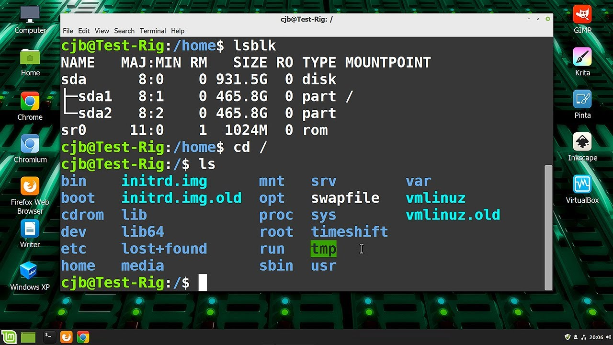
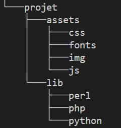

# Préparation

## Avant-propos

Bienvenue dans cette introduction à JavaScript.

Si ce n'est pas encore fait, Je vous encourage vivement à installer les extensions suivantes de VSCode :

- **Markdown Preview Enhanced** : il vous permettra de visualiser les fichiers ".md" (comme celui-ci) de façon plus propre, dans une fenêtre dédiée (icone en haut à droite de cette fenêteou raccourci Ctrl+k v)

- **ESLint** : c'est un outil d’analyse statique pour JavaScript qui détecte et corrige automatiquement les erreurs de code et les incohérences de style.

### Terminal : notions de base

Vous voici aux portes du monde fascinant des geeks — ceux qui carburent au café, collectionnent les t-shirts de groupes mythiques et jonglent avec des lignes de code. Comme tout bon geek, vous allez vous aussi plonger dans le terminal. Le terminal, c’est quoi ? C’est cet outil un peu magique (et parfois intimidant) qui vous permet de parler directement à votre ordinateur, sans passer par les boutons et les menus.

Pour info, il est possible de totalement contrôler tous les aspects d'une machine via le terminal.

Pour ouvrir le terminal sous VSCode, si ce n'est déjà fait, depuis le menu général faites *"Terminal > Nouveau terminal"*.

Dans le terminal, on se promène à l'intérieur des dossiers de l'ordinateur, et on peut passer de dossiers en dossiers pour lancer des *"commandes"*, c'est à dire des instructions que l'ordinateur va devoir éxécuter.

Voici quelques commandes de base du terminal que vous allez devoir apprendre à maîtriser rapidement :

- `ls` : fournit la liste des fichiers et dossiers du dossier actuel (si sur votre système `ls` n'est pas assez verbeux, essayez `ls -l`)
- `cd` : permet de se déplacer à l'intérieur des dossiers comme suit :
    - `cd nomDossier` : permet de rentrer dans le dossier **"nomDossier"** si il existe.
    - `cd nomDossier1/NomDossier1/NomDossier3` : permet de se rendre directement dans le sous-dossier **"NomDossier3"**
    - `cd .. :` permet de revenir en arrière d'un dossier
    - `cd ../.. :` permet de revenir en arrière de deux dossiers.On peut bien sûr répéter ainsi autant de `..` que nécessaire
- `mkdir nomDossier` : Crée le dossier **"nomDossier"** dans le dossier actuel
- `rmdir nomDossier` : Détruit le dossier **"nomDossier"** (si il existe), et tout ce qu'il contient. Et, dans le terminal, pas de corbeille alors *ATTENTION !*)
- `clear` : efface le contenu du terminal. Très utile quand on a déjà lancé pleins de commandes et que notre terminal est pollué de messages.
- `history` : historique des commandes effectuées précédemment. Très utile si vous voulez retrouver une ancienne commande. A noter que vous pouvez rappeler ces anciennes commandes grâce aux flèches de votre clavier (ça évite d'avoir à les retaper à chaque fois).
- `tree` : affiche l'arborescence du dossier actuel.

### Entrainez-vous !

Là, tout de suite, maintenant, créez l'arborescence suivante dans votre dossier actuel en utilisant uniquement le terminal :

Vérifiez votre travail en revenant dans votre dossier principal et en lançant la commande `tree`.

##### Un petit jeu ?
https://luffah.xyz/bidules/Terminus/

### Installation de node.js

Maintenant que vous êtes un pro du terminal, pour exécuter vos programmes JavaScript dans celui-ci, il va vous falloir installer **Node.js**.

Pour synthétiser **Node.js** permet d'exécuter du JavaScript directement sur le serveur (en Back), et pas seulement dans le navigateur web (en Front). C'est en particulier ce qu'il faut utiliser pour développer par exemple des applications en temps réel comme un chatbot, une messagerie instantanée, etc. Bien sûr, **Node.js** ne se limite pas à ça, mais pour le moment, il faudra se contenter de cette définition.

Pour installer **Node.js** rendez-vous à l'url suivante et choisissez l'installateur convenant à votre système :

https://nodejs.org/fr/

Prenez la version appelée "LTS" qui signifie "Long Term Support", ça veut dire que c'est une version stable.

Suivez le processus d'installation, il n'y a pas besoin de cocher quoique ce soit.

Une fois node installé, **fermez (totalement) VSCode** et relancez-le.

Dans le terminal, exécutez la commande suivante : `node ./test-node.js`. Si node est bien installé, le terminal devrait vous afficher un message de confirmation.

### Installation de prompt-sync

**Node.js** vient avec **npm**, un outil qui vous permet d'installer des packages (des morceaux de code) qui proposent des fonctionnalités supplémentaires en JavaScript.

Il y a déjà des millions de développeurs dans le monde entier et certains ont sûrement déjà développé quelque chose dont vous avez besoin, alors pouquoi s'embêter à refaire ce qui a déjà été fait.

Dit encore autrement, face à un besoin spécifique, votre premier réflexe de développeuse ou développeur devra toujours être de vérifier sur internet si quelqu'un ne l'a pas déjà fait et si il est possible de récupérer son code.

C'est ce que nous allons faire tout de suite.

Lancez la commande `npm install 'prompt-sync'` votre terminal va faire des choses de terminal pendant quelques fractions de secondes, et des fichiers *".json"* ainsi qu'un dossier *"node_modules"* vont apparaître dans votre dossier actuel. C'est signe que le module est bien installé.

Ce petit module vous permettra dans vos développements à venir de poser des questions à l'utilisateur directement dans le terminal. Nous aurions très bien pu développer cela nous-mêmes, mais cela aurait nécessité plusieurs dizaines de lignes de code, et comme dit plutôt, pourquoi refaire ce qui a déjà été fait par quelqu'un d'autre ?

Pour tester le module, exécutez la commande suivante : `node .\test-prompt.js`.

Si le terminal vous demande votre prénom et vous souhaite la bienvenue, c'est que tout fonctionne très bien.

Vous êtes prêt pour attaquer votre introduction à JavaScript.