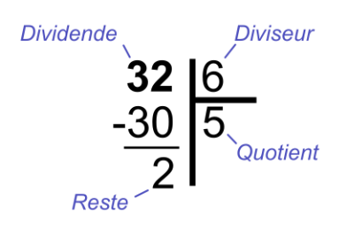
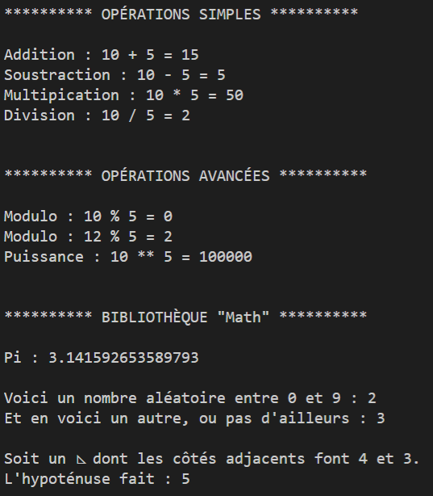

# Les Opérateurs arithmétiques

## Opérations mathématiques simples

Les opérateurs mathématiques suivants sont possibles 

- `+` : addition
- `-` : soustraction
- `*` : multiplication 
- `/` : division
- `%` : modulo
- `**` : puissance

Certaines précautions doivent être prises avec certains, tandis que d'autres méritent d'être expliqués.

### L'addition `+`

Il faut faire attention lorsque l'on utilise l'opérateur d'addition `+` car c'est également celui que l'on doit utiliser en javascript pour faire se que l'on nomme en jargon geek une *concaténation*, c'est à dire, l'action de coller les unes aux autres deux, ou plus, chaînes de caractères.

Pire, si vous utilisez l'opérateur `+` entre une chaîne de caractère et un nombre, ce dernier sera considéré comme du texte.

Ainsi, si le code suivant ne pose aucun problème :

```javascript
console.log(5 + 5); 
// Affiche 10
```

Le code suivant, quant à lui, n'est pas bon :
```javascript
console.log('Résultat de l\'addition : ' + 5 + 5); 
// Affiche "Résultat de l'addition : 55"
```

En effet, l'interpréteur JavaScript ne sachant pas exactement ce que vous attendez de lui, il va d'abord *concaténer* le texte `Résultat de l'addition : ` avec le premier `5`, puis ensuite le tout avec le deuxième `5`.

Dans ce genre de situation, il eut fallu écrire :

```javascript
console.log('Résultat de l\'addition : ' + (5 + 5)); 
// Affiche "Résultat de l'addition : 10"
```

Les parenthèses permettent de traiter en priorité l'addition, et seulement ensuite d'effectuer la concaténation avec le texte.

### La division `/`

La division par 0 n'est pas davantage possible en programmation qu'en Mathématiques classiques.

Si vous effectuez l'instruction `resultat = nb / 0` la majorité des langages produiront une erreur, et pas une belle erreur bien propre. Non, non. Plutôt le genre bon gros plantage bien sale, bien dégueu sans même un message d'erreur. Autrefois, ce genre de bugs pouvait facilement planter le système.

C'est pourquoi le bon développeur, avant toute tentative de division, pense toujours à vérifier que le *diviseur* n'est pas nul.

Ben oui, sauf que JavaScript ne faisant jamais rien comme tout le monde, lui, autorise la division par 0. Et, le plus fort, il trouve un résultat : `Infinity`.

Les mathématiciens du monde entier seront ravis de savoir que, là où eux et leurs confrères échouent depuis approximativement 3000 ans, JavaScript, lui, a trouvée la solution. C'est qu'il est fort ce JavaScript !

Bref, méfiez-vous. Ceci est purement et simplement, une aberration mathématique. Dans vos développements futurs, faites comme-ci JavaScript ne gérait pas la division par 0, et pensez toujours à vérifier le *diviseur*.

  

### Modulo `%`

Avant de parler de *modulo* petit rappel sur les divisions.

Dans une division, vous avez :

- Le ***dividende*** : c'est ce que l'on divise (ex : 10)
- Le ***diviseur*** : c'est ce par quoi on divise (ex: 2)
- Le ***quotient*** : c'est le résultat de la division (ex: 5)
- Le ***reste*** : c'est ce qu'il reste (ex: 0)

À l'école, on a dû vous l'apprendre comme ça :

  { style="display: block; margin: 0 auto" }

Le *modulo*, en fait, c'est juste demander le reste.

**Ainsi :**

- 4 modulo 2 = 0;
- 5 modulo 2 = 1;
- 10 modulo 5 = 0;
- 13 modulo 5 = 3;

**Et en code :**

```javascript
let reste0 = 4 % 2;   // reste = 0
let reste1 = 5 % 2;   // reste = 1
let reste3 = 13 % 5;  // reste = 3
```

***"Ben oui, mais à quoi ça sert ?"*, nous direz-vous.**

Bonne question. Merci de l'avoir posée.

Il vous arrivera, dans vos programmes de vouloir faire une chose particulière tous les n *trucs*, ou tous les n *bidules*, si vous préférez. 

**Par exemple :** mettre en gras un nom sur cinq. OU bien mettre un fond bleu une ligne sur trois. Ou encore détourner un euro toutes les dix fiches de paye (non, oubliez celui-là).

C'est dans ce genre de cas que le *modulo* sera très utile.

Observons les *modulos* de 3 :

```javascript
let reste1  = 1 % 3;   // reste = 1
let reste2  = 2 % 3;   // reste = 2
let reste3  = 3 % 3;   // reste = 0
let reste4  = 4 % 3;   // reste = 1
let reste5  = 5 % 3;   // reste = 2
let reste6  = 6 % 3;   // reste = 0
let reste7  = 7 % 3;   // reste = 1
let reste8  = 8 % 3;   // reste = 2
let reste9  = 9 % 3;   // reste = 0
let reste10 = 10 % 3;  // reste = 1
let reste11 = 11 % 3;  // reste = 2
let reste12 = 12 % 3;  // reste = 0
```

On voit bien que lorsque l'on est sur un multiple de 3 (3, 6, 9, 12...) le reste est de 0, sinon, c'est autre chose (ici 1 ou 2).

Donc, lorsque l'on voudra, dans notre code mettre une ligne sur trois en couleur, il suffira de tester si le numéro de la ligne *modulo* 3 est bien égal à 0. Sinon, on ne fera rien.

### Puissance `**`

Celui-ci est assez explicite, il vous permettra d'écrire rapidement des puissances.

En informatique, les puissances les plus utiles, sont les puissances de 2 (liées au code binaire interne de la machine).

**Et oui :**

- 2^1^ = 2
- 2^2^ = 4
- 2^3^ = 8
- 2^4^ = 16
- 2^5^ = 32
- 2^6^ = 64
- 2^7^ = 128
- 2^8^ = 256
- 2^9^ = 512
- 2^10^ = 1024 (1Mo, 1Go, 1To, ...)
- 2^11^ = 2048 (2Mo, 2Go, 2To, 2K, ...)
- 2^12^ = 4048 (4Mo, 4Go, 4To, 4K, ...)
- ...

Ceci explique les capacités des disques-durs, des clés USB, des carte SD, de la mémoire RAM et également les tailles des téléviseurs.

**Exemple en JavaScript :**

```javascript
let result  = 2**1   // 2
result      = 2**2   // 4
result      = 2**3   // 8
result      = 2**4   // 16
result      = 2**5   // 32
```

## La bibliothèque "Math"

Si vous avez besoin de fonctions Mathématiques autres, n'hésitez pas à regarder dans la bibliothèque *"Math"* de JavaScript (*note : tous les langages ont ce type de bibliothèque*).

Une *bibliothèque* en programmation est un regroupement de pleins de fonctions et outils autour d'un thème, ici, les Mathématiques.

Pour accéder à la bibliothèque *"Math"*, rien de plus simple : dans *VSCode*, tapez `Math.` (le point est important). L'autocomplete va vous proposer un ensemble de fonctions mathématiques automatiquement.

En voici quelques une parmi les plus utiles en programmation :

### Math.floor()

Permet d'arrondir à l'entier inférieur. 

Extrèmement utile en programmation ! Vital même.

**Exemple :**

```javascript
let entier = Math.floor(1.5);   // entier = 1
entier = Math.floor(175.4835);  // entier = 175
```
### Math.random()

Retourne un *float* (nombre à virgule) aléatoire entre 0.00000 et 0.99999.

À combiner avec le précédent pour créer des algorithmes de tirage au sort.

**Exemple de tirage au sort entre trois possibilités (0, 1 ou 2) :**

```javascript
let rand        = Math.random();        // entre 0.00000 et 0.99999
let nbRand      = rand*3;               // entre 0.00000 et 2.99999
let entierRand  = Math.floor(nbRand);   // arrondi à 0, 1 ou 2
```

**Voici comment on l'écrit la plupart du temps :**

```javascript
let rand        = Math.random()*3;      // entre 0.00000 et 2.99999 (directment)
let entierRand  = Math.floor(nbRand);   // arrondi à 0, 1 ou 2
```

**Voire :**

```javascript
let entierRand  = Math.floor(Math.random()*3);   // arrondi à 0, 1 ou 2 (directment)
```

**Top du top :**

```javascript
const max = 3; // En début de progamme
// ...
// du code
// ...
let entierRand  = Math.floor(Math.random()*max);   // de 0 à max-1
```

### Math.round() et Math.ceil()

Moins utilisées en programmation que leur petite soeur `Math.floor()`, les fonctions `Math.round()` et `Math.ceil()` permettent également d'arrondir :

- `Math.round()` arrondi à l'entier le plus proche,
- `Math.ceil()` arrondi à l'entier supérieur.

**Exemple :**

```javascript
let a = Math.floor(4.357);  // a = 4

let b = Math.ceil(4.357);   // b = 5

let c = Math.round(4.357);  // c = 4
let d = Math.round(4.733);  // d = 5
```

Et oui, chez les anglo-saxons, *"arrondir à l'entier supérieur"* c'est *"ceiling"* (plafond), et *"arrondir à l'entier inférieur"* c'est *"floor"* (sol)... Il sont bizarres.

### Math.PI

Notre bonne vielle copine la constante *pi*, mais avec quinze chiffres après la virgule. À privilégier plutôt que de créer la votre.

**Exemple :**

```javascript
let r           = 10;
let perimetre   = 2*Math.PI*r;  // perimetre = 62.83185307179586
let aire        = Math.PI*r**2; // aire = 314.1592653589793
```

### Math.hypot()

Permet de calculer l'hypoténuse d'un triangle rectangle. Si, si !

C'est rare d'en avoir besoin, mais le jour où ça vous tombera dessus, vous serez bien content de savoir qu'il y a une fonction toute prète pour ça. Pas besoin de se faire des noeuds au cerveau avec les racines carrées.

*La prof de Maths en 5ème :*

> "L'hypoténuse est égale à la racine carrée de la somme des carrés des deux autres côtés"

... Nia nia nia ...

*... Tiens Madame, c'est plus simple comme ça :*

```javascript
let a = 3;
let b = 4;
let hyp = Math.hypot(a, b); // hyp = 5
```

 

### Math.sqrt() et Math.cbrt()

Si un jour vous devez calculer une racine carré, rien de plus simple :

```javascript
let a = Math.sqrt(100);  // a = 10
```

Et pour une racine cubique, idem :

```javascript
let a = Math.cbrt(1000);  // a = 10
```

## Pratique

Lancez le programme `les-operateurs.js` avec la commande `node les-operateurs.js`.

Celui-ci effectue divers opération mathématiques et affiche les résultats.

A noter qu'il est également fait massivement usage de la concaténation des chaînes de caractère avec l'opérateur `+`.

Cela permet de faire de créer des messages beaucoup plus intéressants dans le terminal :



N'hésitez pas à ouvrir le fichier, à le modifier !
Amusez-vous, trifouillez, bidouillez, expérimentez, pratiquez.

## En Résumé

- Pour les opérations mathématiques de base, on utilise les opérateurs `+`, `-`, `/` et `*`
    - attention `+` sert aussi à *concaténer* (coller) le texte
    - la division (`/`) par zéro, c'est pas beau
- `%` (modulo), sert à trouver le reste d'une division
- `**` sert à faire des puissance. Exemple : `2**8` donne 256
- La bibliothèque `Math` contient des fonctions Mathématiques dont :
    - `Math.floor()` : pour arrondir un nombre à l'entier inférieur
    - `Math.random()` : pour obtenir un nombre aléatoire (de 0 à 1)
    - `Math.PI` : *pi*
    - `Math.sqrt()` : pour faire trouver la racine carrée d'un nombre