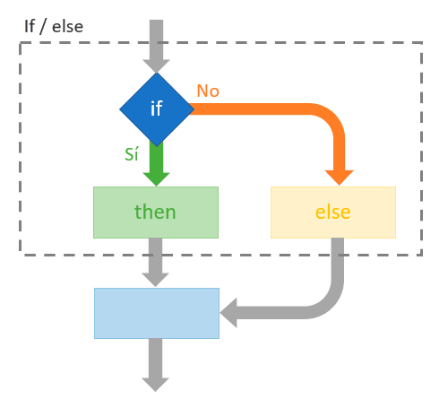

# Les conditions

## Avant-propos

Les structures conditionnelles ou tout simplement les conditions permettent d'exécuter en JavaScript, comme dans tous les langages de développements, des instructions selon si une condition est vérifiée ou non. Par exemple, sur un site e-commerce, on peut finaliser une commande si le panier contient au moins un article. Les conditions s'utilisent principalement avec des variables. C'est une notion qui peut paraître déroutante au premier abord, mais qui est extrêmement importante pour votre apprentissage du JavaScript. Il est indispensable de maîtriser cette notion pour développer efficacement en JavaScript.

### L'instruction `IF` en Javascript

En JS, la condition la plus minimaliste possible requiert l'instruction `if`. En français, on peut tout simplement traduire cette instruction par **si**.

Ci-après la syntaxe d'une condition if

**Exemple :**
```javascript
let nombre = 4;
if(nombre % 2 == 0){
    console.log('La variable nombre est paire car son reste est de 0');
}

// Affiche : La variable nombre est paire car son reste est de 0
```

Nous avons donc l'instruction if puis entre parenthèses le test de la condition. Chaque test est converti en valeur booléenne. Par conséquent, si le test vaut `true`, alors le Javascript exécutera le code à l'intérieur de la condition, si le test vaut `false`, alors il sera ignoré. Il est possible de faire tout un tas de tests complètement différents avec divers opérateurs de comparaisons qui remplissent des fonctions bien différentes.

Chaque bloc d'instructions à exécuter si le test de la condition est vérifié est délimité entre `{` et `}` (accolades ouvrante et fermante). Les opérandes sont les variables ou les valeurs de chaque côté d’un opérateur dans une condition. En l'occurence dans notre exemple ci-dessus, `nombre`, `%2`  et `0`.

Il est possible d'imbriquer les conditions. La syntaxe des instructions `if` n'est pas impactée.

**Exemple :**
```javascript
let nombre = 5;
if(nombre > 3){
    console.log('La variable nombre est strictement supérieur à 3')
    if(nombre < 6){
        console.log('La variable nombre est strictement inférieur à 6');
    }
}

// Affiche : La variable nombre est strictement superieur à 3
// Affiche : La variable nombre est strictement inférieur à 6
```

Dans l'exemple ci-dessus, si la valeur de la variable nombre est comprise entre 0 et 3, alors rien ne s'affiche car la première condition n'est pas vérifiée.

  { style="display: block; margin: 0 auto" }


### L'instruction `ELSE` en Javascript

Il n'est pas rare de vouloir exécuter une instruction si un test de condition est vérifié et une autre si ce n'est pas le cas. Et paf, c'est justement le rôle de l'instruction `else`. Elle est toujours associée à un `if`. Donc les instructions contenues dans le `else` sont exécutées uniquement si le test de condition du `if` n'est pas vérifié. On peut traduire en français cette instruction par **sinon**.

**Exemple :**
```javascript
let nombre = 0;
if(nombre > 1){
    console.log('La variable nombre est strictement supérieur à 1');
} else {
    console.log('La variable nombre est inférieur ou égal à 1');
}

// Affiche : La variable nombre est inférieur ou égal à 1
```

### L'instruction `ELSE IF` en Javascript

Comme son nom l'indique, l'instruction `else if` est une combinaison de l'instruction `if` et `else`. Le bloc d'instruction du `else if` est exécuté uniquement si le test de condition du premier `if` n'est pas vérifié et vaut donc `false`. Seulement, à la différence de `else`, le bloc d'instruction du `else if` ne s'exécutera que si le test de sa condition est vérifié et vaut donc `true`.

```javascript
let nombre = 4;
if(nombre < 1) {
    console.log('la variable nombre est strictement inférieur à 1');
} else if(nombre > 3) {
    console.log('la variable nombre est strictement supérieur à 3');
} else {
    console.log('la variable nombre est comprise entre 1 et 3');
}

// Affiche : La variable nombre est strictement supérieur à 3
```



### Les opérateurs de comparaison

Depuis le début du chapitre nous utilisons très largement le chevron comme opérateur de comparaison qui permet de tester si une valeur est strictement supérieure ou inférieure à une autre. Il existe bien évidemment d'autres opérateurs de comparaison. Ceux que nous utiliserons dans le cours sont listés dans le tableau ci-dessous.

| Opérateur | Desciption |
|---    |:-:   |
| `==` | égale à |
| `===` | strictement égale à |
| `!=` | différente de |
| `>` | strictement supérieur à|
| `<` | strictement inférieur à |
| `>=` | supérieur ou égale à |
| `<=` | inférieur ou égale à |

**Exemple :**
 ```javascript
 console.log(1 == 1);
 console.log(1 === '1');
 console.log(1 != 2);
 console.log(1 > 2);
 console.log(1 < 2);
 console.log(1 >= 2);
 console.log(1 <= 2);

 // Affiche : true
 // Affiche : false
 // Affiche : true
 // Affiche : false
 // Affiche : true
 // Affiche : false
 // Affiche : true
 ```

 ### Les opérateurs logiques

 En JS, les opérateurs logiques sont utilisés pour combiner des tests de conditions. Grâce à ces opérateurs, il est possible d'ajouter plus d'un test de condition dans une seule instruction `if`.

| Opérateur | Desciption |
|---    |:-:   |
| `&&` | **ET** logique, renvoie vrai si et seulement si toutes les opérandes sont vrais |
| `\|\|` | **OU** logique, renvoie vrai si et seulement si au moins une des opérandes est vrai |
| `!` | inverse la logique d'un test de condition |

**Exemple :**
```javascript
let a = 8;
let b = 6;
let c = 0;
if(a && b && c){
    console.log('Les variables a, b et c contiennent des valeurs différentes de false');
} else {
    console.log('Une des variables a, b et/ou c contient false comme valeur');
}

if(a >= 6 || b >= 6 || c >= 6){
    console.log('Une des variables a, b ou c a une valeur supérieur ou égale à 6');
} else {
    console.log('Aucune des variables a, b ou c ne contient une valeur supérieur ou égale à 6');
}

if(!c) {
    console.log('La variable c a une valeur équivalente à false');
} else {
    console.log('La variable c a une valeur équivalente à true');
}

// Affiche : Les variables a, b et c contiennent des valeurs différentes de false

// Affiche : Une des variables a, b ou c a une valeur supérieur ou égale à 6

// Affiche : La variable c a une valeur équivalente à false
```

La compréhension de ce chapitre n'est pas importante, elle est **incontournable**. C'est très important de bien comprendre ces notions. Vous serez sûrement amené à revenir sur ce chapitre pour vous remémorer certaines règles et les différentes syntaxes. C'est normal, ces notions ne sont pas simples. Elles se graveront dans votre mémoire en pratiquant.

## Pratique

Lancez le programme `conditions.js` avec la commande `node conditions.js`.

Celui-ci effectue divers test de conditions et affiche les résultats.

Ensuite, ouvrez le fichier `pairimpair.js` et suivez l'énnoncé. Une fois votre code écrit lancez le programme avec la commande `node pairimpair.js`.

Puis ouvrez le fichier `nombremagique.js` et suivez l'énnoncé. Testez votre code avec la commande `node nombremagique.js`

#### Petit plus

D'autres instructions existes mais nous n'approfrondirons pas ces notions ici. Si vous voulez en savoir plus, voici de la documentation qui peu être utile :
 - https://fr.javascript.info/switch
 - https://developer.mozilla.org/fr/docs/Web/JavaScript/Reference/Statements/switch

###### *sources* :
    - https://developer.mozilla.org/en-US/docs/Web/JavaScript/Reference/Statements/if...else