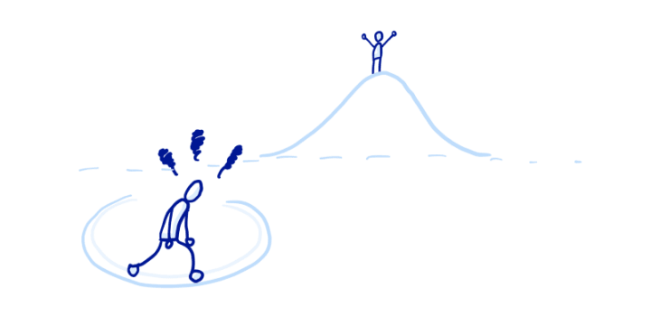

# Les boucles

## Avant-propos

Les boucles permettent de répéter des actions simplement et rapidement. Une boucle peut être vue comme une version informatique de « copier N lignes » ou de « faire X fois quelque chose ». Par exemple, en JavaScript, on pourrait traduire « Faire 5 pas vers l'est » avec la boucle suivante.

**Exemple :**
```javascript
for (let pas = 0; pas < 5; pas +1){
    // La boucle démarre à 0
    // À chaques tour elle augmente le pas de 1
    // Elle s'arrêtera lorsque par sera égale à 4 (strictement inférieur à 5)
    console.log(pas);
}

// Affiche : 0
// Affiche : 1
// Affiche : 2
// Affiche : 3
// Affiche : 4
```

Il y a différents types de boucles mais elles se ressemblent toutes au sens où elles répètent une action un certain nombre de fois (ce nombre peut éventuellement être zéro). Les différents types de boucles permettent d'utiliser différentes façon de commencer et de terminer une boucle. Chaque type de boucle pourra être utilisé en fonction de la situation et du problème que l'on cherche à résoudre.

## La boucle `WHILE`

La boucle while (*tant que*, en français) permet d'exécuter une instruction tant qu'une condition donnée est vérifiée.

**Exemple :**
```javascript
let index = 0;
// boucle tant que index est strictement inférieur à 4
while (index < 4) {
    console.log(index);
    // incrémente la valeur de index
    index = index + 1;
}

// Affiche : 0
// Affiche : 1
// Affiche : 2
// Affiche : 3
```

⚠️⚠️⚠️ Il faut être vigilant sur la condition de sortie d'une boucle `while` sinon on risque d'être bloqué dans une boucle infini... Non, on peut toujours en sortir, mais vifilance tout de même ! ⚠️⚠️⚠️

   { style="display: block; margin: 0 auto" }

## La boucle `FOR`

Une boucle `for` répète des instructions jusqu'à ce qu'une condition donnée ne soit plus vérifiée. La boucle `for` JavaScript ressemble beaucoup à celle utilisée en C ou en Java.

**Exemple :**
```javascript
for (let i = 0; i < 4; i++){
// on déclare un index i que l'on initialise à 0 
// on vérifie que i est strictement inférieur à 3
// on incrémente i de un à chaque tour de boucle
    console.log(i);
}

// Affiche : 0
// Affiche : 1
// Affiche : 2
// Affiche : 3
```
Le résultat est extacement le même qu'avec la boucle `while`.

## La boucle `DO...WHILE`


La boucle `do...while` (**faire...tant que** en français) permet de répéter un ensemble d'instructions jusqu'à ce qu'une condition donnée ne soit plus vérifiée.

**Exemple :**
```javascript
let i = 0;
do{
    // On incrémente l'index i de 1 à chaque tour
    i +=1;
    console.log(i);
} while (i < 4)

// Affiche : 1
// Affiche : 2
// Affiche : 3
// Affiche : 3
```
Dans cet exemple, la boucle `do` est exécutée au moins une fois et répétée jusqu'à ce que i ne soit plus inférieur à 4

## Pratique

Lancez le programme `boucles.js` avec la commande `node boucles.js`.

Ouvrez le fichier `compteur0.js`, suivez les instructions et testez votre code avec la commande `node compteur0.js`.

Faites de même avec les fichiers `compteur10.js`, `compteur99.js` et enfin `compteur100.js` ( ⚠️petite doc utile pour le shifumi : *opérateur logique*, *array.indexOf* et *array.includes* sur **MDN Web Docs** ;) )

#### Petit plus

D'autres instructions existes mais nous n'approfrondirons pas ces notions ici. Si vous voulez en savoir plus, voici de la documentation qui peu être utile :
 - https://developer.mozilla.org/fr/docs/Web/JavaScript/Guide/Loops_and_iteration

###### *sources* :
    - https://developer.mozilla.org/fr/docs/Web/JavaScript/Guide/Loops_and_iteration