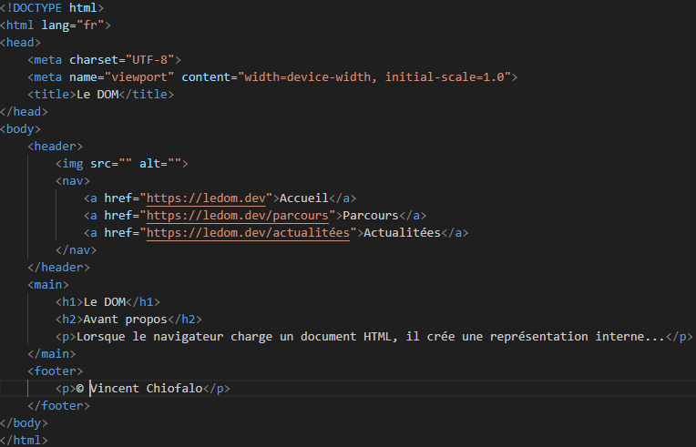

# Le DOM

## Avant propos

Lorsque le navigateur charge un document HTML, il crée une représentation interne de celui-ci appelée **DOM** (Document Object Model).
Le DOM est une **structure arborescente** qui reflète la hiérarchie des éléments HTML d’une page web.
Grâce à cette structure, JavaScript peut **accéder**, **modifier**, **ajouter** ou **supprimer** des éléments du document une fois celui-ci chargé.

Le DOM est aussi une **interface de programmation (API)** qui représente chaque élément HTML comme un **objet** disposant de **propriétés** (pour consulter ou modifier ses caractéristiques) et de **méthodes** (pour agir sur lui ou ses descendants).

Dans cette hiérarchie :

- tous les éléments HTML (balises, attributs, textes, etc.) sont des nœuds (```nodes```) ;

- ces nœuds sont organisés sous deux objets principaux :

  - ```window``` → représente la fenêtre du navigateur ;

  - ```document``` → représente la page web affichée dans cette fenêtre.

##### Les relations entre les nœuds

| Terme                  | Définition                                                                  |
| ---------------------- | --------------------------------------------------------------------------- |
| **Racine (root)**      | Le nœud de plus haut niveau, généralement la balise ```<html>```.               |
| **Parent**             | Un nœud qui contient directement un ou plusieurs autres nœuds.              |
| **Enfant (child)**     | Un nœud situé directement à l’intérieur d’un autre.                         |
| **Descendant**         | Un nœud situé n’importe où à l’intérieur d’un autre (pas forcément direct). |
| **Ancêtre (ancestor)** | Un nœud qui contient un autre nœud, directement ou non.                     |
| **Frères (siblings)**  | Des nœuds qui partagent le même parent.                                     |

---



Dans cet exemple :

- ```<html>``` est le noeud **racine**.
- `````` et ```<nav>``` sont les **enfants** de ```<header>```.
- ```<main>``` est le **parent** de ```<h1>```, ```<h2>``` et ```<p>```.
- ```<h1>```, ```<h2>```, et ```<p>``` dans ```<main>``` sont donc **frères**.
- ```<body>``` est l'**ancêtre** de ```<footer>``` et ```<p>```.


## Les sélecteurs

JavaScript met à disposition plusieurs **méthodes** permettant de **sélectionner précisément** des éléments dans une page web.
Ces sélections s’effectuent selon la syntaxe suivante :
```js
element.method();
```
Ici, ```method``` désigne le **nom de la fonction de sélection** utilisée sur un objet du DOM (souvent ```document```).

Ces méthodes se répartissent en deux grandes catégories :

- **Les sélecteurs traditionnels**
Ils permettent de cibler des éléments selon leur **nom de balise** ou **certains attributs** spécifiques, comme :
  - l’**identifiant** (```id```),
  - la **classe** (```class```).

- **Les sélecteurs CSS**
Ils permettent de cibler des éléments en utilisant la **même syntaxe que les sélecteurs CSS**, offrant ainsi une grande flexibilité dans la recherche d’éléments.

Toutes ces méthodes fonctionnent de manière similaire : elles retournent **un** ou **plusieurs éléments** correspondant à la sélection, que l’on peut ensuite **stocker dans une variable** pour les manipuler via JavaScript.
```js
let selection = document.querySelector('#id');
```

### Les sélecteurs traditionnels

#### Sélection par balise (tag)

Il est possible de sélectionner des éléments HTML **à partir de leur nom de balise** (ou tag) grâce à la méthode :
```js
getElementsByTagName()
```
Cette méthode retourne **une collection d’éléments** correspondant au nom de balise indiqué.
Le résultat prend la forme d’un **objet de type HTMLCollection**, semblable à un tableau JavaScript, sur lequel on peut itérer pour accéder à chaque élément individuellement.
```html
<header>
    
    <nav>...</nav>
</header>
<main>
    <h1>...</h1>
    <h2>...</h2>
    <p>...</p>
</main>
<footer>
    <p>...</p>
</footer>
```
```js
document.getElementsByTagName('p'); // Retourne un tableau d'objets correspondant à toutes les balises "p"
```

#### Sélection par id

Pour sélectionner un élément HTML à partir de son **identifiant unique**, on utilise la méthode :
```js
getElementById();
```
Cette méthode renvoie l’**unique élément** dont l’attribut ```id``` correspond à la valeur spécifiée.
Le résultat est un **objet unique** (et non une collection), que l’on peut manipuler directement en JavaScript.
```html
<main>
    <h1>...</h1>
    <h2>...</h2>
    <p id="description">...</p>
</main>
```
```js
document.getElementById('description'); // Retourne un objet correspondant à balise qui à l'id "description"
```

#### Sélection par class

Il est possible de sélectionner plusieurs éléments HTML partageant la même **classe CSS** grâce à la méthode :
```js
getElementsByClassName();
```
Cette méthode renvoie **tous les éléments** possédant la classe spécifiée.
Le résultat est une **collection d’éléments** de type HTMLCollection, semblable à un tableau JavaScript, que l’on peut parcourir pour accéder à chaque élément individuellement.
```html
<main>
    <h1>...</h1>
    <h2 class="article">...</h2>
    <p class="article">...</p>
</main>
```
```js
document.getElementsByClassName('article'); // Retourne un tableau d'objets correspondant aux 3 balises portant la classe article
```

### Les sélecteurs CSS

Il est également possible de sélectionner des éléments HTML en utilisant des **sélecteurs CSS**, offrant une recherche **plus précise** et **flexible** que celles basées sur les balises, les identifiants ou les classes.

Pour cela, JavaScript met à disposition deux méthodes :
```js
querySelector();
querySelectorAll();
```
- ```querySelector()``` : renvoie **le premier élément** correspondant au sélecteur CSS indiqué.
- ```querySelectorAll()``` : renvoie **tous les éléments** correspondant au sélecteur, sous la forme d'une **NodeList** (semblable à un tableau) que l'on peut parcourir.

#### Sélection unique

La méthode :
```js
querySelector();
```
permet de sélectionner **la première occurrence** d’un élément correspondant au **sélecteur CSS** spécifié.
Elle renvoie **un seul objet élément** du DOM, que l’on peut manipuler directement en JavaScript.
```js
document.querySelector('a'); // Retourne un objet correspondant au 1er "a"
document.querySelector('#nav-barre'); // Retourne un objet correspondant à l'élément qui à l'id "nav-barre"
```

### Sélection multiple

La méthode :
```js
querySelectorAll();
```
permet de sélectionner **toutes les occurrences** des éléments correspondant au **sélecteur CSS** spécifié.
Elle renvoie une **collection d’éléments** sous la forme d’une **NodeList**, semblable à un tableau JavaScript, que l’on peut parcourir pour accéder à chaque élément individuellement.
```html
<main>
    <h1>...</h1>
    <h2 class="article">...</h2>
    <p class="article">...</p>
</main>
<footer>
    <p>...</p>
</footer>
```
```js
document.querySelectorAll('p'); // Retourne un tableau d'objets correspondant à tous les "p"
document.querySelectorAll('.article') // Retourne un tableau d'objets correspondant à tous les éléments qui ont la class "article"
```

## Manipuler le DOM

### Modifier des noeuds existants

Maintenant que l’on sait comment **sélectionner un élément**, nous allons pouvoir **modifier son contenu** en agissant sur les **propriétés de l’objet** correspondant dans le DOM.

Voici une petite liste des propriétés les plus utiles :
- ```textContent``` : Contenu textuel de l'élément
- ```innerHTML``` : Contenu HTML de l'élément
- ```id``` : ID de l'élément
- ```className``` : Classes de l'élément
- ```classList``` : Classes de l'élement mais mais avec des méthodes pratiques :
  - ```.add("nomClasse")``` : ajoute une classe
  - ```.remove("nomClasse")``` : retire une classe
  - ```.toggle("nomClasse")``` : ajoute ou retire une classe
  - ```.contains("nomClasse")``` : vérifie si l'élément possède ou non la classe
- ```style``` : Style CSS de l'élément
- ```value``` : Valeur de l'élément (pour les inputs, les textarea, etc.)
- ```src``` : Source de l'élément (pour les images, les vidéos, etc.)
- ```href``` : URL de l'élément (pour les liens)
- ```alt``` : Texte alternatif de l'élément (pour les images)

💡 Astuce :
- Utilise ```classList``` dès que tu veux **ajouter**, **retirer** ou **alterner** des classes.
- Réserve ```className``` uniquement si tu veux **écraser complètement** toutes les classes d’un élément.

Une fois qu’un élément a été **sélectionné**, il est possible d’en **modifier le contenu** en agissant sur les **propriétés** de l’objet correspondant dans le DOM :
```js
element.style.color = 'green'; // Change la couleur de l'élément sélectionné
element.textContent = 'Nouveau contenu'; // Change le contenu textuel de l'élément sélectionné
element.className = 'active'; // Change (ou ajoute) la classe à l'élément sélectionné
```

#### Modifier un attribut

Un **attribut** est une **information complémentaire** que l’on ajoute à une **balise HTML** pour préciser ou modifier son comportement.
Chaque attribut est composé d’un nom et d’une **valeur**, et se place **à l’intérieur de la balise ouvrante** de l’élément.

Exemple :
```js
<a href="https://www.example.com">Visiter le site</a>
```
Ici :
- ```href``` est le nom de l’attribut,
- ```"https://www.example.com"``` est sa valeur.

Dans la partie précédente, nous avons vu qu’il était possible de modifier les attributs d’un élément en **agissant sur ses propriétés** dans le DOM.

Cependant, le DOM met aussi à disposition des méthodes dédiées, plus simples et plus directes, pour **ajouter**, **modifier** ou **supprimer des attributs** d’un élément HTML :
```js
element.setAttribute("attribut", "nouvelleValeur");
```

### Ajout et supression d'éléments

Avec le DOM, on peut modifier des élements existants, mais on peut aussi **ajouter** et **supprimer** des éléments.

- Créer un nouvel élément : 
```js
let nouvelElement = document.createElement("nomDeLaBalise");
```
- Ajouter un nouvel élément en tant qu'enfant d'un élément existant :
```js
element.appendChild(nouvelElement);
```
- Supprimer un élément enfant :
```js
element.removeChild(enfantASupprimer);
```


## Pratique

Il est grand tant de passer à la pratique. Dans le dossier ```manip-dom```, regardez les différents fichier et dans le fichier ```script.js``` faites les exercices en **suivant les consignes**.

