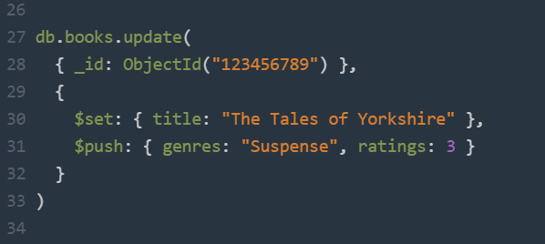

# MongoDB Query

{ style="display: block; margin: 0 auto" }

---

Cette partie du cours traite des **Mongodb queries** pour opérer directement sur la base de données mongo via le *shell*, un *mongodb client* ou un app N*odeJS* avec *MongoClient*. Avant d’aller plus loin, il faut préalablement avoir installé mongodb (voir guide d’installation [Windows](https://www.mongodb.com/docs/manual/tutorial/install-mongodb-on-windows/), [Mac](https://www.mongodb.com/docs/manual/tutorial/install-mongodb-on-os-x/) ou Linux) et créé une base de données. Une base de donnée d'exercice est fournis dans le dossier ;) .

## Requêtes de sélection (Queries de sélection)

Les requêtes de sélection permettent de retrouver un ou plusieurs documents dans une collection MongoDB en fonction de critères précis.

*Syntaxe de base* :
```js
db.nom_de_la_collection.find({ critère })
```

### Requête basique

Par exemple, une query qui retournerais tous les documents d'une collection *users* :
```js
db.users.find( {} )
```
C'est l'équivalent de la requette SQL suivante :
```sql
SELECT * FROM users;
```

### Spécifier une condition d'égalité

Pour spécifier une condition d'égalité, on utilise des expressions de la forme :
```js
{ <champ>: <valeur> }
```
C’est-à-dire que le champ doit correspondre exactement à la valeur indiquée.

*Exemple* :
```js
db.users.find({ firstname: "Vincent" })
```
La requête sélectionne tous les documents de la collection users dont le champ status vaut *"Vincent"*.
Cette requête utilise un filtre :
```js
{ firstname: "Vincent"}
```
Ce qui équivaut à la requête SQL suivante :
```sql
SELECT * FROM users WHERE firstname = "Vincent";
```

### Spécifier des conditions à l’aide des opérateurs de requête

Un **query filter document** peut utiliser des opérateurs de requête pour définir des conditions, sous la forme suivante :
```js
{ <champ>: { <opérateur>: <valeur> }, ... }
```
#### $in ()

La requête suivante récupère tous les documents de la collection *users* dont le champ *firstname* est égal à "Vincent" ou "Maurice" :
```js
db.users.find({ firstname: { $in: [ "Vincent", "Maurice" ] } })
```

⚠️ **Remarque** :
Bien qu’on puisse écrire cette requête en utilisant l’opérateur **$or**, il est préférable d’utiliser **$in** lorsqu’on vérifie plusieurs valeurs possibles d’un même champ. C’est **plus lisible** et souvent **plus performant**.

#### $gt - Greater Than (sypérieur à)

Permet de sélectionner les documents où la valeur d’un champ est strictement supérieure à une certaine valeur.

Par exemple *rechercher les articles dont le montant est supérieur à 100000 :*
```js
db.orders.find({ amount: { $gt: 100000 } })
```

Équivalent SQL :
```sql
SELECT * FROM orders WHERE amount > 100000
```

#### $lt - Less Than (inférieur à)

Permet de filtrer les documents dont la valeur d’un champ est inférieure à une certaine valeur.

Par exemple *rechercher les articles dont les taxes sont inférieurs à 5000 :*
```js
db.orders.find({ taxes: { $lt: 5000 } })
```

Équivalent SQL :
```sql
SELECT * FROM orders WHERE taxes < 5000
```

#### $and (Et logique)

Permet de combiner plusieurs conditions. Toutes doivent être vraies pour qu’un document soit sélectionné.

Par exemple *rechercher les commandes dont le client est "Chiofalo Vincent" et le montant supérieur à 100000 :*
```js
db.orders.find({
  $and: [
    { client: "Chiofalo Vincent" },
    { amount: { $gt: 100000 } }
  ]
})
```

Équivalent SQL :
```sql
SELECT * FROM orders WHERE client = "Chiofalo Vincent" AND amount > 100000
```

#### $or (Ou logique)

Permet de filtrer les documents qui satisfont au moins une des conditions spécifiées.

Par exemple *rechercher les commandes soit d’un certain client, soit avec un montant élevé :*
```js
db.orders.find({
  $or: [
    { client: "Chiofalo Vincent" },
    { amount: { $gt: 100000 } }
  ]
})
```

SQL équivalent :
```sql
SELECT * FROM orders WHERE client = "Chiofalo Vincent" OR amount > 100000
```

### Pour aller plus loin

#### $exists P(résence d’un champ)

Permet de vérifier si un champ existe ou non dans un document.

Par exemple *rechercher les documents qui ont un champ taxes :*
```js
db.orders.find({ taxes: { $exists: true } })
```

Équivalent SQL (approximatif) :
```sql
SELECT * FROM orders WHERE taxes IS NOT NULL
```

On peut aussi vérifier l'absence :
```js
db.orders.find({ taxes: { $exists: false } })
```

#### $regex (Filtrer avec une expression régulière)

Permet de faire une recherche textuelle partielle (comme un LIKE en SQL).

Par exemple *rechercher tous les clients dont le nom commence par "Chi" :*
```js
db.orders.find({ client: { $regex: /^Chi/ } })
```

SQL équivalent :
```sql
SELECT * FROM orders WHERE client LIKE 'Chi%'
```

#### $elemMatch (Filtrer dans un tableau d’objets)

Permet de rechercher un élément spécifique dans un tableau complexe (tableau d’objets).

Par exemple *rechercher les commandes où un article a pour sku "27' 4K Monitor" et un prix supérieur à 50000 :*
```js
db.orders.find({
  items: {
    $elemMatch: {
      sku: "27' 4K Monitor",
      price: { $gt: 50000 }
    }
  }
})
```
Cela garantit que le même objet dans le tableau items respecte les deux conditions.

En SQL, on se retrouverais avec des tables relationnelles.

#### $size (Taille d’un tableau)

Permet de filtrer les documents dont un tableau contient exactement un certain nombre d’éléments.

Par exemple *rechercher les commandes avec exactement 2 articles :*
```js
db.orders.find({ items: { $size: 2 } })
```

#### Combiner des opérateurs

Il est possible de combiner tous ces opérateurs ensemble, par exemple :
```js
db.orders.find({
  $and: [
    { client: { $regex: /^Chi/i } },
    { "items": { $elemMatch: { price: { $gte: 50000 } } } }
  ]
})
```

| Opérateur    | Description                                         | Exemple                                                                       | Équivalent SQL                     |
| ------------ | --------------------------------------------------- | ----------------------------------------------------------------------------- | ---------------------------------- |
| `$eq`        | Égal à                                              | `{ status: "D" }`                                                             | `= 'D'`                            |
| `$gt`        | Supérieur à                                         | `{ amount: { $gt: 100000 } }`                                                 | `> 100000`                         |
| `$lt`        | Inférieur à                                         | `{ taxes: { $lt: 5000 } }`                                                    | `< 5000`                           |
| `$in`        | Inclus dans une liste de valeurs                    | `{ status: { $in: ["A", "D"] } }`                                             | `IN ('A', 'D')`                    |
| `$and`       | Toutes les conditions doivent être vraies           | `{ $and: [ { client: "Vincent" }, { amount: { $gt: 1000 } } ] }`              | `AND`                              |
| `$or`        | Au moins une condition doit être vraie              | `{ $or: [ { client: "Vincent" }, { amount: { $gt: 1000 } } ] }`               | `OR`                               |
| `$exists`    | Vérifie si un champ existe ou non                   | `{ taxes: { $exists: true } }`                                                | `IS NOT NULL` (approximatif)       |
| `$regex`     | Recherche textuelle avec expression régulière       | `{ client: { $regex: /^Chi/i } }`                                             | `LIKE 'Chi%'`                      |
| `$elemMatch` | Condition multiple sur un même élément d’un tableau | `{ items: { $elemMatch: { sku: "27' 4K Monitor", price: { $gt: 50000 } } } }` | N/A (pas équivalent direct en SQL) |
| `$size`      | Nombre exact d’éléments dans un tableau             | `{ items: { $size: 2 } }`                                                     | N/A                                |
