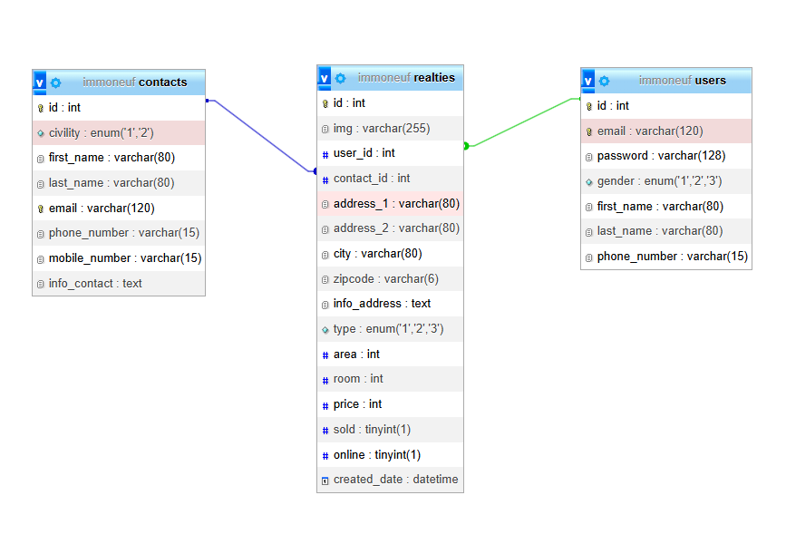
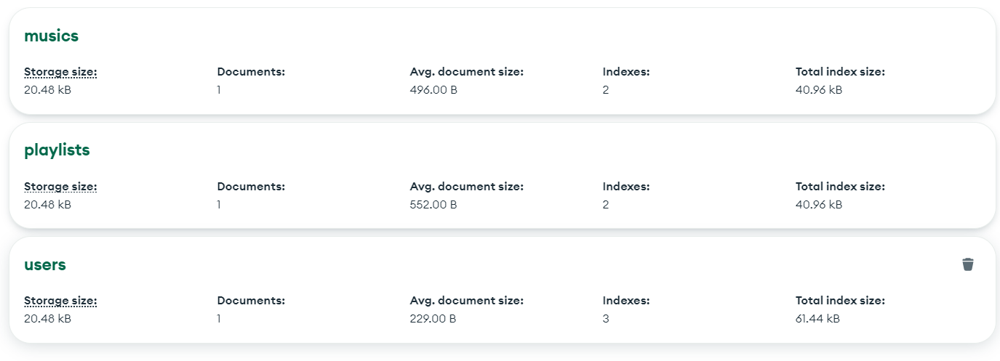
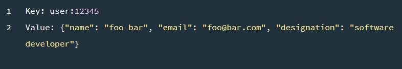

# Partie 1 : Introduction

## Chapitre 1 : Introduction et présentation du programme

### 1. Présentation du programme de la formation

Bienvenue dans cette formation de deux jours sur SQL et MySQL ! Ce programme a été conçu pour vous aider à maîtriser les concepts fondamentaux et les compétences pratiques nécessaires pour travailler avec les bases de données relationnelles en utilisant SQL et MySQL.

Au cours de cette formation, vous apprendrez à créer, gérer et interroger des bases de données à l'aide de différentes techniques et outils.

Dans tous les cas, je vous conseiller d'aller sur le site sql.sh qui est une mine d'or pour apprendre le SQL : https://sql.sh/.

## Chapitre 2 : Qu'est-ce qu'une base de données ?

### 2.1 Introduction aux bases de données

Une base de données est un système organisé de stockage d'informations qui permet d'effectuer des opérations pour créer, modifier, récupérer et supprimer des données. 

Les bases de données relationnelles organisent les données en tables composées de lignes et de colonnes. Chaque table représente une entité (par exemple, un client ou un produit) et chaque ligne représente un enregistrement (une instance de cette entité).

Les termes qui reviennent souvent : 

- SGBD (Système de Gestion de Base de Données) : Un SGBD est un logiciel qui permet de gérer et d'organiser les bases de données. Il offre des fonctionnalités pour la création, la modification, la suppression et la récupération des données, ainsi que pour la gestion des utilisateurs, la sécurité, les sauvegardes, etc. Les exemples courants de SGBD sont MySQL, Oracle, Microsoft SQL Server et PostgreSQL.

- Langage de base de données : Un langage de base de données est un langage spécifique utilisé pour communiquer avec un SGBD et manipuler les données. SQL (Structured Query Language) est le langage de base de données le plus couramment utilisé. Il permet d'effectuer des opérations telles que la création et la modification de schémas de base de données, l'interrogation des données, l'insertion, la mise à jour et la suppression de données, etc.

- Schéma de base de données : Un schéma de base de données définit la structure logique d'une base de données. Il spécifie les tables, les colonnes, les contraintes, les relations et les autres objets de la base de données. Le schéma de base de données décrit la manière dont les données sont organisées et les règles qui s'appliquent à ces données.

- Modèle (logique ou conceptuel) de base de données : Un modèle de base de données est une représentation de la structure d'une base de données. Les modèles de base de données couramment utilisés sont le modèle relationnel, le modèle hiérarchique, le modèle en réseau et le modèle orienté objet. Le modèle relationnel est le plus répandu et utilise des tables, des clés primaires et des relations pour organiser les données.

- Requête SQL : Une requête SQL est une instruction utilisée pour interroger une base de données et récupérer des données spécifiques. Les requêtes SQL peuvent être simples, comme une sélection de toutes les lignes d'une table, ou complexes, impliquant des opérations de jointure, des conditions et des agrégations.

- Index : Un index est une structure de données utilisée pour accélérer la recherche des données dans une base de données. Il améliore les performances en créant un moyen rapide d'accéder aux enregistrements en fonction de certaines colonnes. Les index sont souvent créés sur des colonnes fréquemment utilisées dans les requêtes de recherche pour réduire le temps de recherche.

- Une clause en SQL est une instruction ou une partie spécifique d'une requête qui définit une action ou une condition particulière. Les clauses sont utilisées pour spécifier les opérations à effectuer lors de l'exécution d'une requête SQL, telles que la sélection, la filtration, le tri ou la jointure des données.
  Les clauses sont généralement combinées pour former une requête SQL complète. Chaque clause a un objectif spécifique et contribue à déterminer les résultats et le comportement de la requête.

- NoSQL : Le terme « NoSQL » désigne les différents types de bases de données non relationnelles. Ces bases de données stockent les données dans un format différent. Toutefois, les bases de données NoSQL peuvent être interrogées à l'aide d'API en langage idiomatique, de langages déclaratifs et de langages de requête par exemple, ce qui explique pourquoi elles sont également considérées comme des bases de données « pas seulement SQL ».

## Chapitre 3 : Introduction à SQL et MySQL

### 3.1 Qu'est-ce que SQL ?

SQL (Structured Query Language) est un langage de programmation standardisé utilisé pour communiquer avec des bases de données relationnelles. SQL permet d'effectuer des opérations telles que la création, la modification, la suppression et la récupération de données à partir de bases de données.

### 3.2 Qu'est-ce que MySQL ?

MySQL est un système de gestion de bases de données relationnelles (SGBD / RDBMS en anglais) open source et gratuit. 
Un SGBD est un logiciel qui permet a des utilisateurs d'interagir avec une base de données sans avoir à gérer de nombreux aspects complexes (par exemple, le stockage des données, la sécurité, les sauvegardes, etc.).

MySQL est l'un des SGBD les plus populaires au monde. Il est utilisé par de nombreuses entreprises et organisations, dont Facebook, Twitter, YouTube, Netflix, Airbnb, Uber, etc.

*Exemple de base de donnée relationnel :*
{ style="display: block; margin: 0 auto" }

## Chapitre 4 : Introduction à NoSQL

### 4.1 Qu'est ce que le NoSQL ?

Les bases de données NoSQL (ou « *not only SQL* ») stockent les données différemment des tables relationnelles. Les bases de données NoSQL sont disponibles dans différents types en fonction de leur modèle de données, dont les principaux sont document, clé-valeur, orientée colonnes et graphique. Elles fournissent des schémas flexibles et s’adaptent facilement à de grandes quantités de big data et à des charges d’utilisateurs élevées.

### 4.2 Bases de données documents

Une **base de données orientée documents** est une base de données destinée aux applications qui gèrent des documents. Également nommée « *magasin de documents* », c'est un programme informatique et un système de stockage de données conçu pour stocker, récupérer et gérer des informations orientées documents, également appelées données semi-structurées.

*Exemple de base de données orientée documents :*
{ style="display: block; margin: 0 auto" }

Deux langages sont maintenant principalement utilisés pour représenter les documents structurés : **XML** et **JSON**.

*Exemple de document structuré :*
{ style="display: block; margin: 0 auto" }

### 4.3 Bases de données clé-valeur

Un magasin **clé-valeur** est un type de base de données plus simple où chaque élément contient des clés et des valeurs. Chaque clé est unique et associée à une seule valeur. Elles sont utilisées pour la mise en cache et la gestion de session et offrent des performances élevées en lecture et en écriture, car elles stockent généralement les éléments en mémoire.

*Exemple de structure de base de donnée clé-valeur :*
{ style="display: block; margin: 0 auto" }

*Exemple de donnée clé-valeur :*
{ style="display: block; margin: 0 auto" }