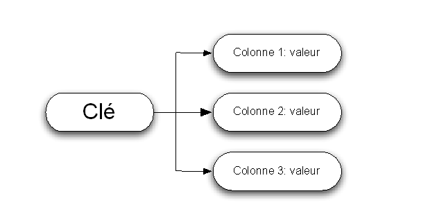
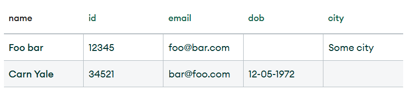
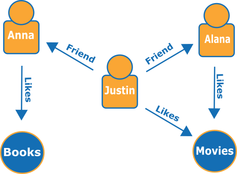

# Partie 1 : Introduction

## Chapitre 1 : Introduction et présentation du programme

### 1. Présentation du programme de la formation

Bienvenue dans cette formation de trois jours sur SQL et MySQL ! Ce programme a été conçu pour vous aider à maîtriser les concepts fondamentaux et les compétences pratiques nécessaires pour travailler avec les bases de données relationnelles en utilisant SQL et MySQL.

Au cours de cette formation, vous apprendrez à créer, gérer et interroger des bases de données à l'aide de différentes techniques et outils.

Dans tous les cas, je vous conseiller d'aller sur le site sql.sh qui est une mine d'or pour apprendre le SQL : https://sql.sh/.

---

## Chapitre 2 : Qu'est-ce qu'une base de données ?

### 2.1 Introduction aux bases de données

Une base de données est un système organisé de stockage d'informations qui permet d'effectuer des opérations pour créer, modifier, récupérer et supprimer des données. 

Les bases de données relationnelles organisent les données en tables composées de lignes et de colonnes. Chaque table représente une entité (par exemple, un client ou un produit) et chaque ligne représente un enregistrement (une instance de cette entité).

Les termes qui reviennent souvent : 

- SGBD (Système de Gestion de Base de Données) : Un SGBD est un logiciel qui permet de gérer et d'organiser les bases de données. Il offre des fonctionnalités pour la création, la modification, la suppression et la récupération des données, ainsi que pour la gestion des utilisateurs, la sécurité, les sauvegardes, etc. Les exemples courants de SGBD sont MySQL, Oracle, Microsoft SQL Server et PostgreSQL.

- Langage de base de données : Un langage de base de données est un langage spécifique utilisé pour communiquer avec un SGBD et manipuler les données. SQL (Structured Query Language) est le langage de base de données le plus couramment utilisé. Il permet d'effectuer des opérations telles que la création et la modification de schémas de base de données, l'interrogation des données, l'insertion, la mise à jour et la suppression de données, etc.

- Schéma de base de données : Un schéma de base de données définit la structure logique d'une base de données. Il spécifie les tables, les colonnes, les contraintes, les relations et les autres objets de la base de données. Le schéma de base de données décrit la manière dont les données sont organisées et les règles qui s'appliquent à ces données.

- Modèle (logique ou conceptuel) de base de données : Un modèle de base de données est une représentation de la structure d'une base de données. Les modèles de base de données couramment utilisés sont le modèle relationnel, le modèle hiérarchique, le modèle en réseau et le modèle orienté objet. Le modèle relationnel est le plus répandu et utilise des tables, des clés primaires et des relations pour organiser les données.

- Requête SQL : Une requête SQL est une instruction utilisée pour interroger une base de données et récupérer des données spécifiques. Les requêtes SQL peuvent être simples, comme une sélection de toutes les lignes d'une table, ou complexes, impliquant des opérations de jointure, des conditions et des agrégations.

- Index : Un index est une structure de données utilisée pour accélérer la recherche des données dans une base de données. Il améliore les performances en créant un moyen rapide d'accéder aux enregistrements en fonction de certaines colonnes. Les index sont souvent créés sur des colonnes fréquemment utilisées dans les requêtes de recherche pour réduire le temps de recherche.

- Une clause en SQL est une instruction ou une partie spécifique d'une requête qui définit une action ou une condition particulière. Les clauses sont utilisées pour spécifier les opérations à effectuer lors de l'exécution d'une requête SQL, telles que la sélection, la filtration, le tri ou la jointure des données.
  Les clauses sont généralement combinées pour former une requête SQL complète. Chaque clause a un objectif spécifique et contribue à déterminer les résultats et le comportement de la requête.

- NoSQL : Le terme « NoSQL » désigne les différents types de bases de données non relationnelles. Ces bases de données stockent les données dans un format différent. Toutefois, les bases de données NoSQL peuvent être interrogées à l'aide d'API en langage idiomatique, de langages déclaratifs et de langages de requête par exemple, ce qui explique pourquoi elles sont également considérées comme des bases de données « pas seulement SQL ».

---

## Chapitre 3 : Introduction à SQL et MySQL

### 3.1 Qu'est-ce que SQL ?

SQL (Structured Query Language) est un langage de programmation standardisé utilisé pour communiquer avec des bases de données relationnelles. SQL permet d'effectuer des opérations telles que la création, la modification, la suppression et la récupération de données à partir de bases de données.

Ces bases de données relationnelles se composent de 3 parties :

- **Les Tables** : Un tableau de colonnes et de lignes. L’ensemble des tables composent la base de données (BDD).
- **Les Colonnes** définissent les différentes catégories qui composent les informations d’une donnée.
- **La clé primaire** et **la clé étrangère** permettent de mettre en relation différentes tables.

### 3.2 Qu'est-ce que MySQL ?

MySQL est un système de gestion de bases de données relationnelles (SGBD / RDBMS en anglais) open source et gratuit. 
Un SGBD est un logiciel qui permet a des utilisateurs d'interagir avec une base de données sans avoir à gérer de nombreux aspects complexes (par exemple, le stockage des données, la sécurité, les sauvegardes, etc.).

MySQL est l'un des SGBD les plus populaires au monde. Il est utilisé par de nombreuses entreprises et organisations, dont Facebook, Twitter, YouTube, Netflix, Airbnb, Uber, etc.

*Exemple de base de donnée relationnel :*
{ style="display: block; margin: 0 auto" }

---

## Chapitre 4 : Introduction à NoSQL

### 4.1 Qu'est ce que le NoSQL ?

Les bases de données NoSQL (ou « *not only SQL* ») stockent les données différemment des tables relationnelles. Les bases de données NoSQL sont disponibles dans différents types en fonction de leur modèle de données, dont les principaux sont document, clé-valeur, orientée colonnes et graphique. Elles fournissent des schémas flexibles et s’adaptent facilement à de grandes quantités de big data et à des charges d’utilisateurs élevées.

### 4.2 Bases de données documents

Une **base de données orientée documents** est une base de données destinée aux applications qui gèrent des documents. Également nommée « *magasin de documents* », c'est un programme informatique et un système de stockage de données conçu pour stocker, récupérer et gérer des informations orientées documents, également appelées données semi-structurées.

*Exemple de base de données orientée documents :*
{ style="display: block; margin: 0 auto" }

Deux langages sont maintenant principalement utilisés pour représenter les documents structurés : **XML** et **JSON**.

*Exemple de document structuré :*
{ style="display: block; margin: 0 auto" }

### 4.3 Bases de données clé-valeur

Un magasin **clé-valeur** est un type de base de données plus simple où chaque élément contient des clés et des valeurs. Chaque clé est unique et associée à une seule valeur. Elles sont utilisées pour la mise en cache et la gestion de session et offrent des performances élevées en lecture et en écriture, car elles stockent généralement les éléments en mémoire.

*Exemple de structure de base de donnée clé-valeur :*
{ style="display: block; margin: 0 auto" }

*Exemple de donnée clé-valeur :*
{ style="display: block; margin: 0 auto" }

### 4.4 Bases de données orientées colonnes

Les **bases de données orientées colonnes**, ou **magasins orientés colonnes**, stockent et lisent des données en lignes et sont organisées sous forme d'ensemble de colonnes.

*Exemple de structure de base de donnée orientée colonne :*
{ style="display: block; margin: 0 auto" }

Ces bases de données peuvent utiliser des techniques de compression de colonne pour réduire l’espace de stockage et améliorer les performances. La taille importante des lignes et des colonnes permet une récupération efficace des données disparates et volumineuses.

*Exemple de donnée orientée colonne :*
{ style="display: block; margin: 0 auto" }

### 4.5  Bases de données graphiques

Une **base de données graphique** stocke les données sous la forme de nœuds et d'arêtes. Les nœuds stockent généralement des informations sur les personnes, les lieux et les objets (comme les noms), tandis que les arêtes stockent des informations sur les relations entre les nœuds. Ce mécanisme fonctionne bien pour les données fortement connectées, où les relations ou les schémas ne sont pas toujours évidents au départ.

*Exemple de base de donnée graphique :*
{ style="display: block; margin: 0 auto" }

---

# Partie 2 : Installation

## Chapitre 1 : Installation de MySQL

Pour installer MySQL sur votre ordinateur, suivez les instructions fournies par la documentation officielle : https://dev.mysql.com/doc/refman/8.0/en/installing.html

## Chapitre 2 : Installation d'un outil de gestion

Après avoir installé MySQL, il est recommandé d'installer un outil de gestion de bases de données pour faciliter le travail avec MySQL. Voici deux options populaires :

- MySQL Workbench : un outil graphique de gestion de bases de données MySQL. Pour l'installer, suivez les instructions sur le site officiel : https://www.mysql.com/products/workbench/

- phpMyAdmin : un outil web de gestion de bases de données MySQL. Pour l'installer, suivez les instructions sur le site officiel : https://www.phpmyadmin.net/

Pour nous faciliter la vie, nous allons utiliser un package de logiciels, comprenant MySQL et phpMyAdmin, qui s'appelle Wampp. Pour l'installer, suivez les instructions sur le site officiel : https://www.wampserver.com/

Il permet d'installer d'un coup : Apache, MySQL, et PHP

# Partie 3 : Qu'est-ce qu'une requête SQL ?

## Chapitre 1 : Bases de SQL et syntaxe

### 1.1 Requête SQL : Une question à la base de données

Une **requête SQL** est la **commande SQL** la plus élémentaire. Il s'agit d'une question que vous posez à une base de données. Dans ce chapitre, nous allons nous plonger dans les connaissances de base des requêtes SQL pour vous permettre de démarrer votre voyage dans SQL avec des connaissances pratiques dès maintenant !

Une requête SQL est une commande utilisée pour extraire des données d'une base de données. C'est un instrument flexible qui permet d'accéder aux données nécessaires.

Une requête SQL est essentiellement **une question qu'un utilisateur pose à une base de données**. Les questions peuvent varier en complexité, de " *quels sont les modèles de voitures vendus ?* " à " *combien de voitures Volvo sont vendues en moyenne à l'entreprise de M. Dupont chaque année ?* ".

```sql
SELECT colonne,
FROM nom_de_la_table
```

Ici, la requête est composé de deux clauses (deux questions).

Par convention, les mots clés SQL sont écrits en majuscules. Cependant, il est possible d'écrire les mots clés en minuscules, mais cela peut rendre la requête plus difficile à lire.

De plus, il est conseillé de revenir à la ligne après chaque clause pour améliorer la lisibilité de la requête.

### 1.2 Les types de données SQL

Les types de données SQL sont utilisés pour définir le type de données que peut contenir une colonne. Voici quelques types de données courants :

- INT : un entier (nombre entier)
- FLOAT : un nombre à virgule flottante (nombre réel)
- VARCHAR(n) : une chaîne de caractères de longueur variable, où n est la longueur maximale
- DATE : une date (AAAA-MM-JJ)
- DATETIME : une date et heure (AAAA-MM-JJ HH:MM:SS)

Pour commencer, on ne va pas construire nous même les bases de données, nous allons utiliser des bases de données déjà existantes. Nous n'avons donc pas d'intérêt a développer davantage les types de données.

### 1.3 Les opérateurs SQL

Les opérateurs SQL permettent de comparer, combiner ou effectuer des opérations sur les données. Voici quelques opérateurs courants :

* = : égal
* <> ou != : différent
* < : inférieur
* \> : supérieur
* <= : inférieur ou égal
* \>= : supérieur ou égal
* AND : combine deux conditions, toutes deux doivent être vraies
* OR : combine deux conditions, l'une d'elles doit être vraie
* NOT : inverse la condition

### 1.4 Les clauses SELECT, FROM et WHERE

- SELECT : spécifie les colonnes à récupérer dans la requête
- FROM : spécifie la table à partir de laquelle récupérer les données
- WHERE : spécifie une condition que les enregistrements doivent respecter pour être récupérés

```sql
SELECT nom, prenom
FROM utilisateurs
WHERE email = 'titi.dupont@email.com';
```

Ici notre requête nous renverra les **noms** et **prénoms** des **utilisateurs** dont l'**email** correspondra à *titi.dupont@email.com*

**Pratiquons !!**

Rdv au fichier exo.md niveau 1

## Chapitre 2 : Filtrage et tri des données

### 2.1 Utilisation de AND, OR et NOT

Les opérateurs AND, OR et NOT permettent de combiner ou de modifier des conditions dans une clause WHERE.

```sql
-- Exemple avec AND
SELECT nom, prenom
FROM utilisateurs
WHERE email = 'titi.dupont@email.com' AND nom = 'dupont';

-- Exemple avec OR
SELECT nom, prenom
FROM utilisateurs
WHERE email = 'titi.dupont@email.com' OR nom = 'tata.mercier@email.com';

-- Exemple avec NOT
SELECT nom, prenom
FROM utilisateurs
WHERE NOT email = 'titi.dupont@email.com';
```

### 2.2 Opérateurs de comparaison

Les opérateurs de comparaison permettent de comparer les valeurs des colonnes aux valeurs spécifiées.

```sql
-- Exemple avec < (inférieur à)
SELECT nom, prenom
FROM utilisateurs
WHERE age < 30;

-- Exemple avec >= (supérieur ou égal à)
SELECT nom, prenom
FROM utilisateurs
WHERE age >= 18;
```

### 2.3 Fonctions d'agrégation (COUNT, SUM, AVG, MIN, MAX)
Les fonctions d'agrégation permettent de réaliser des calculs sur un ensemble de lignes. Voici quelques fonctions d'agrégation courantes :

- COUNT(): compte le nombre de lignes
- SUM(): calcule la somme des valeurs d'une colonne
- AVG(): calcule la moyenne des valeurs d'une colonne
- MIN(): trouve la valeur minimale d'une colonne
- MAX(): trouve la valeur maximale d'une colonne

```sql
-- Exemple avec COUNT()
SELECT COUNT(*) AS nombre_clients
FROM clients;

-- Exemple avec SUM()
SELECT SUM(salaire) AS total_salaires
FROM employes;

-- Exemple avec AVG()
SELECT AVG(salaire) AS salaire_moyen
FROM employes;

-- Exemple avec MIN()
SELECT MIN(salaire) AS salaire_min
FROM employes;

-- Exemple avec MAX()
SELECT MAX(salaire) AS salaire_max
FROM employes;
```

**Pratiquons !!**

Rdv au fichier exo.md niveau 2

### 2.4 Tri des données avec ORDER BY

La clause ORDER BY permet de trier les résultats d'une requête selon une ou plusieurs colonnes.

```sql
-- Trier les clients par nom (ordre croissant)
SELECT nom, prenom, email
FROM clients
ORDER BY nom ASC;

-- Trier les clients par nom (ordre décroissant)
SELECT nom, prenom, email
FROM clients
ORDER BY nom DESC;

-- Trier les clients par nom, puis par prénom
SELECT nom, prenom, email
FROM clients
ORDER BY nom ASC, prenom ASC;

-- Trier les clients par nom croissant, puis par prénom (ordre décroissant)
-- C'est étrange mais possible !
SELECT nom, prenom, email
FROM clients
ORDER BY nom ASC, prenom DESC;
```

### 2.5 Limitation des résultats avec LIMIT

La clause LIMIT permet de limiter le nombre de lignes renvoyées par une requête.

```sql
-- Récupérer les 10 premiers clients
SELECT nom, prenom, email
FROM clients
ORDER BY nom ASC
LIMIT 10;

-- Récupérer les clients 11 à 20
SELECT nom, prenom, email
FROM clients
ORDER BY nom ASC
LIMIT 10 OFFSET 10;
```

**Pratiquons !!**

Rdv au fichier exo.md niveau 3

## Chapitre 3 : Les requêtes de tri et de regroupement personnalisées.

### 3.1 Utilisation de LIKE et NOT LIKE

L'opérateur LIKE permet de rechercher des enregistrements qui correspondent à un modèle spécifique. Il est souvent utilisé avec le caractère générique %, qui correspond à n'importe quelle chaîne de caractères.

```sql
-- Récupérer les clients dont le nom commence par 'D'
SELECT nom, prenom, email
FROM clients
WHERE nom LIKE 'D%';

-- Récupérer les clients dont le nom se termine par 'on'
SELECT nom, prenom, email
FROM clients
WHERE nom LIKE '%on';

-- Récupérer les clients dont le nom contient 'on'
SELECT nom, prenom, email
FROM clients
WHERE nom LIKE '%on%';

-- Récupérer les clients dont le nom ne contient pas 'on'
SELECT nom, prenom, email
FROM clients
WHERE nom NOT LIKE '%on%';
```

### 3.2 Utilisation de IN et NOT IN

L'opérateur IN permet de rechercher des enregistrements dont la valeur d'une colonne correspond à l'une des valeurs spécifiées.

```sql
-- Récupérer les clients dont le nom est 'Dupont' ou 'Durand'
SELECT nom, prenom, email
FROM clients
WHERE nom IN ('Dupont', 'Durand');

-- Récupérer les clients dont le nom n'est pas 'Dupont' ou 'Durand'
SELECT nom, prenom, email
FROM clients
WHERE nom NOT IN ('Dupont', 'Durand');
```

**Pratiquons !!**

Rdv au fichier exo.md niveau 4

### 3.3 Utilisation de BETWEEN et NOT BETWEEN

L'opérateur BETWEEN permet de rechercher des enregistrements dont la valeur d'une colonne est comprise entre deux valeurs spécifiées.

```sql
-- Récupérer les clients dont l'âge est compris entre 20 et 30 ans
SELECT nom, prenom, email
FROM clients
WHERE age BETWEEN 20 AND 30;

-- Récupérer les clients dont l'âge n'est pas compris entre 20 et 30 ans
SELECT nom, prenom, email
FROM clients
WHERE age NOT BETWEEN 20 AND 30;
```

### 3.4 Utilisation de IS NULL et IS NOT NULL

L'opérateur IS NULL permet de rechercher des enregistrements dont la valeur d'une colonne est NULL.

```sql
-- Récupérer les clients dont l'adresse est NULL
SELECT nom, prenom, email
FROM clients
WHERE adresse IS NULL;

-- Récupérer les clients dont l'adresse n'est pas NULL
SELECT nom, prenom, email
FROM clients
WHERE adresse IS NOT NULL;
```

**Pratiquons !!**

Rdv au fichier exo.md niveau 5

### 3.5 Utilisation de GROUP BY et HAVING

La clause GROUP BY permet de regrouper les enregistrements ayant la même valeur dans une colonne. La clause HAVING permet de filtrer les résultats d'une requête GROUP BY.

```sql
-- Récupérer le nombre de clients par ville
SELECT ville, COUNT(*) AS nombre_clients
FROM clients
GROUP BY ville;

-- Récupérer les villes ayant plus de 10 clients
SELECT ville, COUNT(*) AS nombre_clients
FROM clients
GROUP BY ville
HAVING COUNT(*) > 10;
```

### 3.6 Utilisation de DISTINCT

L'opérateur DISTINCT permet de supprimer les doublons des résultats d'une requête.

```sql
-- Récupérer les villes des clients
SELECT ville
FROM clients;

-- Récupérer les villes des clients (sans doublons)
SELECT DISTINCT ville
FROM clients;
```

### 3.7 Utilisation de AS

L'opérateur AS permet de renommer une colonne ou une table dans une requête.

```sql
-- Récupérer les villes des clients (avec un alias)
SELECT DISTINCT ville AS ville_client
FROM clients;
```

**Pratiquons !!**

Rdv au fichier exo.md niveau 6


Dans cette session, nous avons couvert les bases de la syntaxe SQL, les opérateurs, les types de données, et les clauses pour filtrer, trier et limiter les résultats des requêtes. Dans la session suivante, nous aborderons des sujets plus avancés, tels que les manipulations de données et les jointures.

---

# Partie 3 : Les requêtes de selection avancées